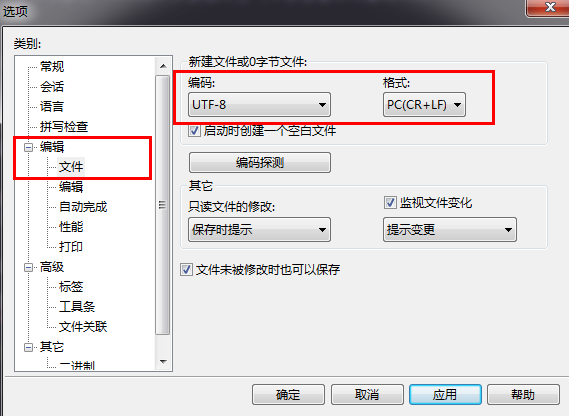


<font size=4>
欢迎访问<a href="http://xiahouzuoxin.github.io/notes/">个人网站</a>，所有文章都可在网站上浏览。
<font>
</br>

# 第一篇 分类目录

## 1 嵌入式

- DSP 	

	- [数字信号处理中各种频率关系](essays/数字信号处理中各种频率关系.md)
	- [滤波器设计指标](essays/滤波器设计指标.md)
	- [模拟信号采样与AD转换](essays/模拟信号采样与AD转换.md)
	- [在DSP671x上使用Timer统计信号处理算法的时间消耗](essays/在DSP671x上使用Timer统计信号处理算法的时间消耗.md)
	- [TMS320C6713烧写Flash的通用方法](essays/TMS320C6713烧写Flash的通用方法.md)
	- [DSP连接不上CCS3.3的问题讨论](essays/DSP连接不上CCS3.3的问题讨论.md)
	- [烧写Flash后的DSP程序运行不正常的情况分析](essays/烧写Flash后的DSP程序运行不正常的情况分析.md)
	- [导出CCS3.3数据及使用matlab处理的方法](essays/导出CCS3.3数据及使用matlab处理的方法.md)
	- [功率谱的一点理解](essays/功率谱的一点理解.md)
	- [TI-DSP数学库之c67xmathlib的使用](essays/TI-DSP数学库之c67xmathlib的使用.md)
	- [DSP/BIOS使用入门](essays/DSP-BIOS使用入门.md)
	- [DSP/BIOS使用之初窥门径——滴答时钟及烧写Flash](essays/DSP-BIOS使用之初窥门径——滴答时钟及烧写Flash.md)

- FPGA

	- [FPGA的复位](essays/FPGA的复位.md)
	- [FPGA的边沿检测](essays/FPGA的边沿检测.md)
	- [使用Tcl脚本分配FPGA管脚](essays/使用Tcl脚本分配FPGA管脚.md)
	- [Quartus_ii中使用Testbench仿真的方法](essays/Quartus_ii中使用Testbench仿真的方法.md)
	- [CycloneII系列FPGA结构](essays/CycloneII系列FPGA结构.md)

- ARM

	- [基于SPI的双MCU通信](essays/基于SPI的双MCU通信.md)


- 硬件设计

	- [高频总线上的串阻问题](essays/高频总线上的串阻问题.md)
	- [FPGA与DSP通信中的EMIF速率问题](essays/FPGA与DSP通信中的EMIF速率问题.md)
	- [设计DSP与FPGA数据采集硬件系统时遇到的一些问题整理](essays/设计DSP与FPGA数据采集硬件系统时遇到的一些问题整理.md)
	- [低功耗模式下锂电池使用时长的估算](essays/低功耗模式下锂电池使用时长的估算.md)
	- [AlteraFPGA功耗估计工具](essays/AlteraFPGA功耗估计工具.md)
	- [EP2C8F256的官方原理图库存在问题](essays/EP2C8F256的官方原理图库存在问题.md)
	- [PCB设计参考资料](essays/PCB设计参考资料.md)
	- [三极管的电平转换及驱动电路分析](essays/三极管的电平转换及驱动电路分析.md)
	- [DCDC纹波小实验](essays/DCDC纹波小实验.md)
	- [运放参数解释及常用运放选型](essays/运放参数解释及常用运放选型.md)
	- [使用Pspice进行电路仿真](essays/使用Pspice进行电路仿真.md)
	- [地震传感器参数指标及使用事项](essays/地震传感器参数指标及使用事项.md)
	


## 2 图像 音频 机器学习

- OpenCV

	- [CentOS上编译安装OpenCV-2.3.1与ffmpeg-2.1.2](essays/CentOS上编译安装OpenCV-2.3.1与ffmpeg-2.1.2.md)
	- [OpenCV基础篇之读取显示图片](essays/OpenCV基础篇之读取显示图片.md)
	- [OpenCV基础篇之使用CMake管理工程](essays/OpenCV基础篇之使用CMake管理工程.md)
	- [OpenCV基础篇之Mat数据结构](essays/OpenCV基础篇之Mat数据结构.md)
	- [OpenCV基础篇之像素访问](essays/OpenCV基础篇之像素访问.md)
	- [OpenCV基础篇之图片叠加](essays/OpenCV基础篇之图片叠加.md)
	- [OpenCV基础篇之像素操作对比度调节](essays/OpenCV基础篇之像素操作对比度调节.md)
	- [OpenCV基础篇之查找表](essays/OpenCV基础篇之查找表.md)
	- [OpenCV基础篇之绘图及RNG随机数对象](essays/OpenCV基础篇之绘图及RNG随机数对象.md)

- 网络资源

	- [图像牛人链接及数据库资源](essays/图像牛人链接及数据库资源.md)


## 3 数学 算法

- [数学牛人matrix67](http://www.matrix67.com/blog/)
- [数理统计知识整理——回归分析与方差分析](essays/数理统计知识整理——回归分析与方差分析.md)
- [整数转字符串的一种快速实现](essays/整数转字符串的一种快速实现.md)
- [转载@韩昊：傅里叶分析之掐死教程（完整版）](http://zhuanlan.zhihu.com/wille/19763358)
- 转载@StackExchange：常见算法在实际项目中的应用 [英文版 ](http://cstheory.stackexchange.com/questions/19759/core-algorithms-deployed/19773#19773)[中文版](http://blog.jobbole.com/52669/)
- [矩阵特征值分解与奇异值分解含义解析及应用](essays/矩阵特征值分解与奇异值分解含义解析及应用.md)
- [循环的角度求均值](essays/循环的角度求均值.md)
- [位反转算法](essays/位反转算法.md)
- [白话压缩感知](essays/白话压缩感知.md)


## 4 计算机

- C/C++

	- [实例学习gcc+gdb+make](essays/实例学习gcc+gdb+make.md)
	- [数组的指针特性](essays/数组的指针特性.md)
	- [位运算的绝妙用法](essays/位运算的绝妙用法.md)

- Matlab 

	- [Matlab的多线程工具Timer](essays/Matlab的多线程工具Timer.md)
	- [Matlab中的笛卡尔坐标及极坐标](essays/Matlab中的笛卡尔坐标及极坐标.md)
	- [matlab与C联合编程](essays/matlab与C联合编程.md)

- Linux 

	- [Linux系统备份](essays/Linux系统备份.md)
	- [增大虚拟机CentOS控制台大小](essays/增大虚拟机CentOS控制台大小.md)
	- [设置CentOS启动默认进入控制台而不是图形界面](essays/设置CentOS启动默认进入控制台而不是图形界面.md)
	- [CentOS在Win7下的硬盘安装](essays/CentOS在Win7下的硬盘安装.md)
	- [CentOS更新yum源的方法](essays/CentOS更新yum源的方法.md)
	- [CentOS配置smaba与Windows共享文件](essays/CentOS配置smaba与Windows共享文件.md)
	- [CentOS安装中文字体](essays/CentOS安装中文字体.md)
	- [Shell及VIM命令小技巧](essays/Shell及VIM命令小技巧.md)

- Git

	- [Git的版本和分支管理](essays/Git的版本和分支管理.md)
	- [Git使用补遗](essays/Git使用补遗.md)

- 上位机

	- [LabVIEW上位机与串口通信](essays/LabVIEW上位机与串口通信.md)

## 5 阅读 写作 其它

- 读书写作

	- [关于阅读的名言](essays/关于阅读的名言.md)
	- [读塞缪尔《失实》](essays/读塞缪尔《失实》.md)
	- [金庸武侠小说之我的见解](essays/金庸武侠小说之我的见解.md)
	- [一首诗熟记三十六计](essays/一首诗熟记三十六计.md)
	- [此心安处是吾乡——苏轼《定风波》](essays/此心安处是吾乡——苏轼《定风波》.md)
	- [秋意](essays/秋意.md)
	- [使用Markdown书写](essays/使用Markdown书写.md)
	- [Markdown中插入数学公式的方法](essays/Markdown中插入数学公式的方法.md)
	- [Latex入门](essays/Latex入门.md)
	- [拾掇起来的年华](essays/拾掇起来的年华.md)
	- [声波能从空气中穿透墙体传播吗](essays/声波能从空气中穿透墙体传播吗.md)
	- [（转载）成功并不像想象的那么难](essays/成功并不像想象的那么难.md)
	- [百家讲坛《曾国藩家训》——无一日不读书](essays/百家讲坛《曾国藩家训》——无一日不读书.md)
	- [我使用Everedit书写Markdown笔记的模板](essays/我使用Everedit书写Markdown笔记的模板.md)
	- [插入视频测试](essays/插入视频测试.md)

- 读论文

	- [中国计算机学会推荐国际学术会议和期刊目录](http://www.ccf.org.cn/sites/ccf/paiming.jsp)
	

# 第二篇 说明

本工程中，未特殊说明的笔记全部原创，一字一字从键盘上敲出来的，转载请注明出处：<https://github.com/xiahouzuoxin>，谢谢！

## 浏览方式选择

1.	[本Github](https://github.com/xiahouzuoxin/notes)上的Markdown格式

2.	[个人博客](http://xiahouzuoxin.github.io/notes/)，但在博客上浏览Markdown格式需要使用“Google浏览器+Markdown Preview Plus插件”，但我推荐这种方式——公式图片神马都无障碍显示。

本笔记完全使用Markdown书写，并首先发布在[Github](https://github.com/xiahouzuoxin)，Github支持Markdown格式的预览，你可以直接在[Github](https://github.com/xiahouzuoxin/notes)上无障碍的阅览。我也为本工程使用Github的Pages功能设置了博客，你也可以到<http://xiahouzuoxin.github.io/notes/>浏览。

如果Download这些笔记到本地，则推荐“Google浏览器+Markdown Preview Plus插件”的方式进行本地浏览。

关于如何使用Markdown书写，可以参见我的笔记“[使用Markdown书写](essays/使用Markdown书写.md)”。

## 目录结构

工程中文件目录的安排如下：

	README.md     Markdown文件索引目录

	README.html   html文件索引目录，对应个人网站下的Category标签

	Archives.html 记录文档创建的日期，可在个人网站上按日期浏览

	AboutMe.html  关于作者的一些个人信息

	Links.html    搜集的一些很有用的链接

	index.html    个人网站主页

	html/         所有笔记的html文本格式

	essays/       所有笔记的Markdown文本格式

	codes/        存放可供下载的代码

	images/       存放文档中的所有图片
 
	enclosure/    存放可供下载的附件（pdf等）

## 编辑器与Html生成

笔记书写使用的编辑器是everedit（一款小巧的国产编辑器），文档的默认编码格式设置如下图（`工具->设置->常规`，在`编辑`选项中）：



本笔记中使用Chrome+Markdown Preview Plus插件将Markdwon转成html的方法：

使用Chrome打开md文件，在工具栏中选择`Markdown Preview Plus`插件，`Export to html`，将转成的html存放到目录`html/`下。

## 文章更新流程

1.	查看当前分支是否为master，否则切换到master分支（保证在master分支写文章，最后合并到gh-pages分支发布到博客）

	```
	git branch
	git checkout master
	```

2.	写正文：在master分支的essays内使用Markdown写文章
3.	转Html：使用`Chrome`浏览器+`Markdown Preview Plus`插件，将文章导出一份html格式，并同名保存在html目录下。

	修改html文件：1.替换css样式为`../stylesheets/Github.css`； 2.替换“返回主目录”字符串的链接为`../README.html`即html格式的README文件； 3.选择是否添加“一键分享”按钮
	
4.	修改文件：

	4.1.	修改README.md目录文件：添加essays/下的新添的文章链接到目录中
	
	4.2.	修改README.html目录文件：添加html/下的新添的文章链接到目录中

	4.3.	修改Archives.html文件：保存文件创建日期

	4.4.	修改index.html即个人网站的首页，更新Updates项
	
8.	提交到Github

	```
	git add .
	git commit -m "my comments"
	git push -u origin master      # 提交master分支，保证这时在master分支
	git checkout gh-pages          # 切换到gh-pages分支
	git merge master               # 将master分支内容合并到gh-pages 
	git push -u origin gh-pages    # 将更新内容发布到Github静态博客
	```


# 第三篇 关于我

1. 学历
	- 2009级本科：北京科技大学，电子信息工程专业
	- 2013级硕士：北京科技大学，计算机技术专业（保送）
2. 座右铭
	- 千淘万漉虽辛苦，吹尽狂沙始到金。    ——（唐）刘禹锡	
3. 联系邮箱（欢迎学习交流）
	- <xiahouzuoxin@163.com>
	- <g20138503@xs.ustb.edu.cn>

Created in 2014.03.