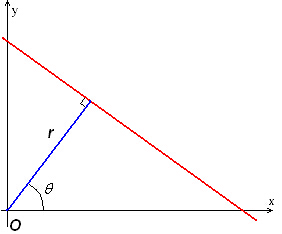
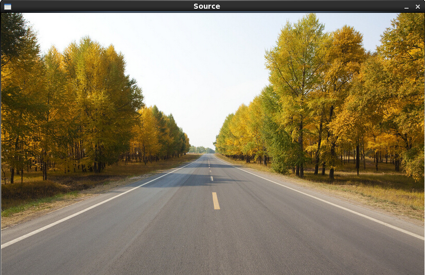
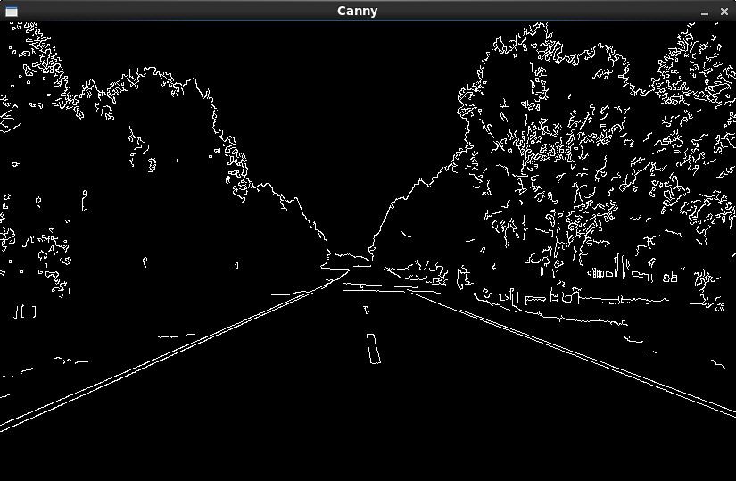
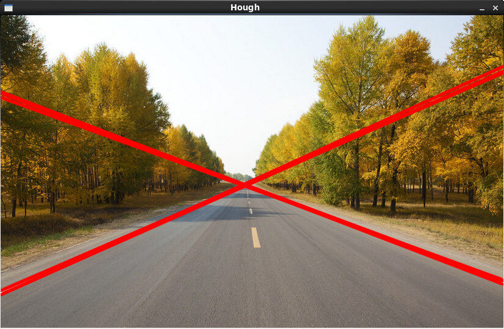
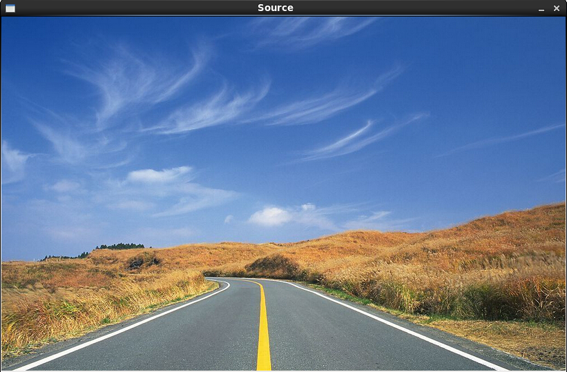
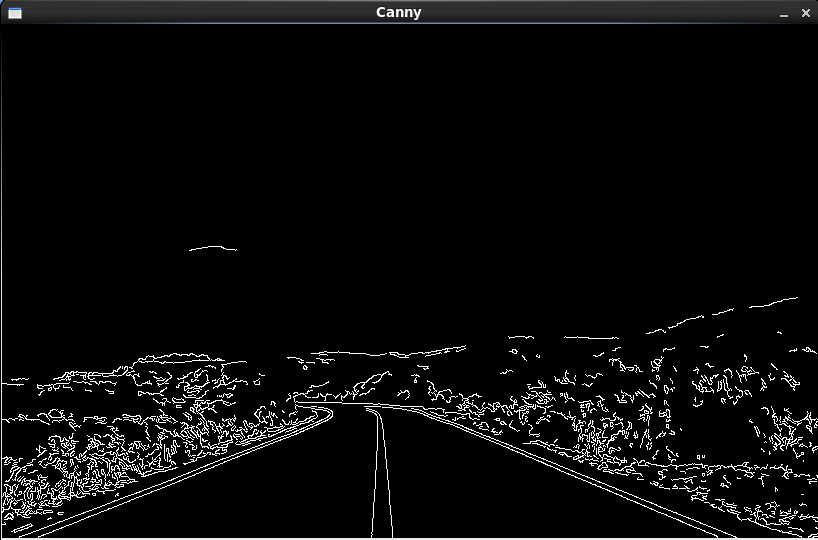
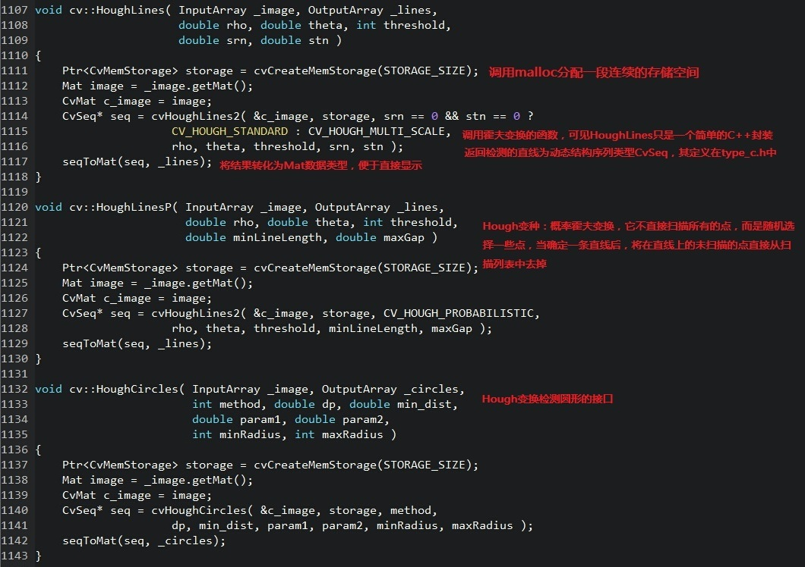

<!---title:OpenCV图像处理篇之Hough变换-->
<!---keywords:OpenCV-->
<!---dkte:2014-11-20-->

## 图像空间到参数空间的转换

对于图像中共线的点集{(x0,y0), (x1,y1), ...}都经过直线y=kx+b，先在我们换一个说法，“斜率为k，截距为b的直线y=kx+b包含了所有在该直线上的点”。一种强调的是图像中的点集，另一种强调的是直线的参数k和b，通过直线的点集去描述这条直线明显没有直接通过k,b两个参数去描述那样直接方便。而Hough变换就是将我们“点共线”的思维转化到参数空间{k,b}进行描述，图像空间中所有经过y=kx+b的点经过Hough变换后在参数空间都会相交于点(k,b)，这样，通过Hough变换，就可以将图像空间中直线的检测转化为参数空间中对点的检测。我们不妨将y=kx+b进行一下变形：


这就是Hough变换将图像空间坐标(x,y)转化为参数空间(k,b)的Hough变换式。

Hough变换的步骤（执行过程）：

1.	在参数空间中建立一个二维（分别对应k,b）计数器，实际就是二维数组kbcnt，k维度为图像中直线斜率可能范围，b维度为图像中截距可能范围；数组中所有值都初始化为0；

2.	扫描图像空间中的所有点(xi,yi)，Hough变换式进行图像空间到参数空间的变换(ki,bi)，计数kbcnt(ki,bi)++

3.	设定阈值thr（图像中有多少个点共线才认为存在直线），kbcnt(ki,bi)>thr的ki,bi组成图像中的直线y=ki*x+bi

然而，上面的检测直线的方案貌似还有些问题：如果图像中存在竖直的直线呢，那kbcnt的k维度岂不是要无穷大！因此，才有了另一种参数空间的方案：利用极坐标参数而非“斜率-截距式”描述直线。



极坐标中的直线方程为


将其改写成Hough变换式，即自变量(x,y)到参数变量(r,$theta$)的映射：


使用极坐标参数空间，Hough变换的步骤不变，只不过将kbcnt替换成rthcnt，r范围是图像对角线的长度，th范围是0~2*pi。因为图像是离散的，所以r和th都有一个步进值dr和dth。

Hough变换除了检测直线，还可用来检测任何能用数学表达式表示的形状，如最常见的圆、椭圆，基本原理都是将图像空间的像素转变到参数空间，然后在参数空间中对共线/圆/椭圆的点进行统计，最后通过阈值判决是否是符合要求的形状。

<http://en.wikipedia.org/wiki/Hough_transform> 上对Hough变换的内容有更多的描述。

## OpenCV中的Hough变换

```cpp
/*
 * FileName : hough.cpp
 * Author   : xiahouzuoxin @163.com
 * Version  : v1.0
 * Date     : Wed 26 Nov 2014 09:52:45 PM CST
 * Brief    : 
 * 
 * Copyright (C) MICL,USTB
 */
#include "cv.h" 
#include "highgui.h"
#include "opencv2/imgproc/imgproc.hpp"

using namespace cv;
using namespace std;

int main(int argc, char *argv[])
{
    if (argc < 2) {
        cout<<"Usage: ./hough [image file name]"<<endl;
        return -1;
    }

    Mat src = imread(argv[1], CV_LOAD_IMAGE_COLOR);
    if (!src.data) {
        cout<<"Read image error"<<endl;
        return -1;
    }
    namedWindow("Source", CV_WINDOW_AUTOSIZE);
    imshow("Source", src);

    Mat img;
    cvtColor(src, img, CV_RGB2GRAY); 
    GaussianBlur(img, img, Size(3,3), 0, 0);
    Canny(img, img, 100, 200, 3);
    namedWindow("Canny", CV_WINDOW_AUTOSIZE);
    imshow("Canny", img);

    vector<Vec2f> lines;
    HoughLines(img, lines, 1, CV_PI/360, 200);  // 返回直线坐标对
    for (size_t i=0; i<lines.size(); i++) {
        float rho = lines[i][0]; 
        float theta = lines[i][1];
        Point pt1,pt2;
        double a=cos(theta);
        double b=sin(theta);
        double x0 = rho*a;
        double y0 = rho*b;
        pt1.x = cvRound(x0+1000*(-b));
        pt1.y = cvRound(y0+1000*a);
        pt2.x = cvRound(x0-1000*(-b));
        pt2.y = cvRound(y0-1000*a);
        line(src, pt1, pt2, Scalar(0,0,255), 3, CV_AA);
    } 
    namedWindow("Hough", CV_WINDOW_AUTOSIZE);
    imshow("Hough", src);

    waitKey();

    return 0;
}
```

在做Hough变换之前，一般都要先使用LOG或Canny先检测边缘，再对边缘图像进行Hough变换操作，上面程序使用Canny算子检测边缘，Canny算子`Canny(img, img, 100, 200, 3);`的两个阈值100,100选择很重要，间接影响Hough检测的结果，同时`HoughLines`中的阈值参数也应该细调。用上面程序对道路直线进行检测结果如下，












## Hough变换源码分析

Hough变换的源代码在`modules/imgproc/src/hough.cpp`中，提供了3种Hough变换源码：直线检测、概率Hough变换检测直线、圆检测，如果要实现其它有解析方程的图形的检测，则要自己动手写了。



先看Hough检测直线的代码，`cvHoughLines2`也只不过是个对不同Hough方法的封装，下面是该函数中的部分代码，选择不同的Hough变换方法，

```cpp
switch( method )
{
case CV_HOUGH_STANDARD:
      icvHoughLinesStandard( img, (float)rho,
            (float)theta, threshold, lines, linesMax );      // 标准Hough变换
      break;
case CV_HOUGH_MULTI_SCALE:
      icvHoughLinesSDiv( img, (float)rho, (float)theta,
            threshold, iparam1, iparam2, lines, linesMax );  // 多尺度Hough变换
      break;
case CV_HOUGH_PROBABILISTIC:
      icvHoughLinesProbabalistic( img, (float)rho, (float)theta,
            threshold, iparam1, iparam2, lines, linesMax );  // 概率Hough变换
      break;
default:
    CV_Error( CV_StsBadArg, "Unrecognized method id" );
}
```

不妨详细看看标准Hough变换的实现代码，

```cpp
/* 这段注释解释了函数各个参数的作用
Here image is an input raster;
step is it's step; size characterizes it's ROI;
rho and theta are discretization steps (in pixels and radians correspondingly).
threshold is the minimum number of pixels in the feature for it
to be a candidate for line. lines is the output
array of (rho, theta) pairs. linesMax is the buffer size (number of pairs).
Functions return the actual number of found lines.
*/
static void
icvHoughLinesStandard( const CvMat* img, float rho, float theta,
                       int threshold, CvSeq *lines, int linesMax )
{
    cv::AutoBuffer<int> _accum, _sort_buf;    // _accum：计数用数组，_sort_buf，排序用数组
    cv::AutoBuffer<float> _tabSin, _tabCos;   // 提前计算sin与cos值，避免重复计算带来的计算性能下降

    const uchar* image;
    int step, width, height;
    int numangle, numrho;
    int total = 0;
    float ang;
    int r, n;
    int i, j;
    float irho = 1 / rho;   // rho指像素精度，常取1，因此irho常为1
    double scale;

    CV_Assert( CV_IS_MAT(img) && CV_MAT_TYPE(img->type) == CV_8UC1 );

    image = img->data.ptr;
    step = img->step;
    width = img->cols;
    height = img->rows;

    numangle = cvRound(CV_PI / theta);  // 根据th精度计算th维度的长度
    numrho = cvRound(((width + height) * 2 + 1) / rho);  // 根据r精度计算r维度的长度

    _accum.allocate((numangle+2) * (numrho+2));
    _sort_buf.allocate(numangle * numrho);
    _tabSin.allocate(numangle);
    _tabCos.allocate(numangle);
    int *accum = _accum, *sort_buf = _sort_buf;
    float *tabSin = _tabSin, *tabCos = _tabCos;
    
    memset( accum, 0, sizeof(accum[0]) * (numangle+2) * (numrho+2) );

    for( ang = 0, n = 0; n < numangle; ang += theta, n++ )   // 计算三角函数表，避免重复计算
    {
        tabSin[n] = (float)(sin(ang) * irho);
        tabCos[n] = (float)(cos(ang) * irho);
    }

    // stage 1. fill accumulator 
    for( i = 0; i < height; i++ )
        for( j = 0; j < width; j++ )
        {
            if( image[i * step + j] != 0 )
                for( n = 0; n < numangle; n++ )
                {
                    r = cvRound( j * tabCos[n] + i * tabSin[n] );  // Hough极坐标变换式
                    r += (numrho - 1) / 2;
                    accum[(n+1) * (numrho+2) + r+1]++;  // 计数器统计
                }
        }

    // stage 2. find local maximums
    for( r = 0; r < numrho; r++ )
        for( n = 0; n < numangle; n++ )
        {
            int base = (n+1) * (numrho+2) + r+1;
            if( accum[base] > threshold &&             // 大于阈值，且是局部极大值
                accum[base] > accum[base - 1] && accum[base] >= accum[base + 1] &&
                accum[base] > accum[base - numrho - 2] && accum[base] >= accum[base + numrho + 2] )
                sort_buf[total++] = base;
        }

    // stage 3. sort the detected lines by accumulator value
    icvHoughSortDescent32s( sort_buf, total, accum );

    // stage 4. store the first min(total,linesMax) lines to the output buffer
    linesMax = MIN(linesMax, total);  // linesMax是输入参数，表示最多输出多少个直线参数
    scale = 1./(numrho+2);
    for( i = 0; i < linesMax; i++ )
    {
        CvLinePolar line;           // 输出结构，就是(r,theta)
        int idx = sort_buf[i];
        int n = cvFloor(idx*scale) - 1;
        int r = idx - (n+1)*(numrho+2) - 1;
        line.rho = (r - (numrho - 1)*0.5f) * rho;
        line.angle = n * theta;
        cvSeqPush( lines, &line );  // 确定的直线入队列输出
    }
}
```

Hough.cpp中对输出结构的定义为：

```cpp
typedef struct CvLinePolar
{
    float rho;           
    float angle;         
} CvLinePolar;
```

其它的Hough变换采用类似的方式逐层可以分析其源码，不妨自己试试？


