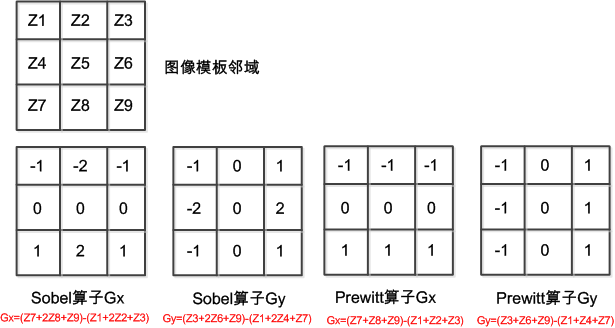
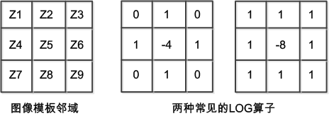
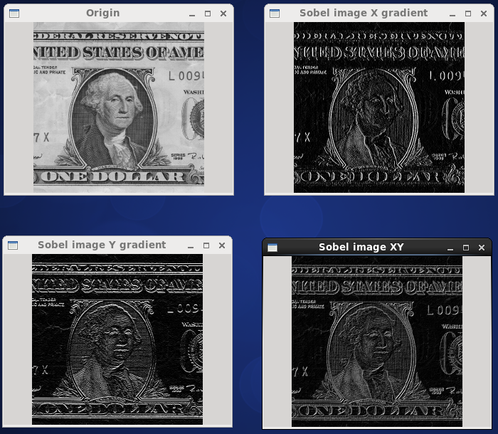
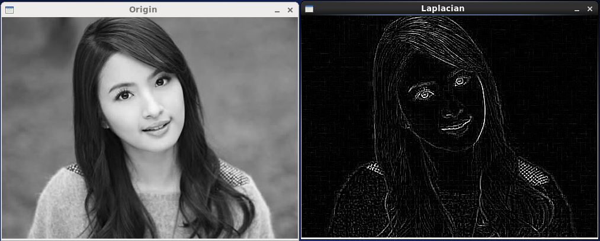
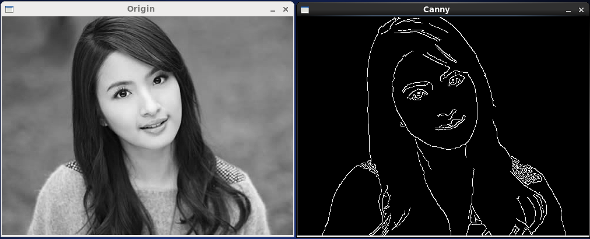

<!---title:OpenCV图像处理篇之边缘检测算子-->
<!---keywords:OpenCV-->
<!---date:2014-11-16-->

## 3种边缘检测算子

灰度或结构等信息的突变位置是图像的边缘，图像的边缘有幅度和方向属性，沿边缘方向像素变化缓慢，垂直边缘方向像素变化剧烈。因此，边缘上的变化能通过梯度计算出来。

### 一阶导数的梯度算子

对于二维的图像，梯度定义为一个向量，


Gx对于x方向的梯度，Gy对应y方向的梯度，向量的幅值本来是 $mag(f)=({G_x}^2+{G_y}^2)^{1/2}$，为简化计算，一般用mag(f)=|Gx|+|Gy|近似，幅值同时包含了x而后y方向的梯度信息。梯度的方向为 $\alpha=arctan(Gx/Gy)$ 。

由于图像的数字离散特性，所以梯度微分运算用差分代替，并且用小的空域模板和图像进行卷积近似计算梯度，由于模板的不同，因此衍生处多种梯度算子：Roberts算子、Sobel算子和Prewitt算子。



平滑模板都有一个特点，即模板内所有平滑值的和为0，因此梯度计算的步骤是：

1.	计算Gx与Gy
2.	用mag(f)=|Gx|+|Gy|近似近似计算(x,y)点处的梯度值G(x,y)
3.	模板中心移动一个像素点，计算下一像素点的梯度值（这一平移求和的过程实质就是卷积运算）
4.	计算完所有的像素点处的梯度值后，选择一个阈值T，如果(x,y)处的G(x,y)>T，则认为该点是边缘点

### 高斯拉普拉斯算子

上面的一阶导数算子，是各向异性的，因此分x方向和y方向的梯度值，而高斯拉普拉斯算子是对图像求二阶导数，边缘对应二阶导数的过零点。


由上式可知，xy进行互换的结果是一样的，所以拉普拉斯算子没有x方向和y方向的区分，拉普拉斯算子对应图像中的差分运算是：


也可以通过卷积模板实现，



相对于一阶导数，高斯拉普拉斯算子（Laplacian of Gaussian, LOG算子）由于求二阶导数，很容易将点噪声判别为边界，因此常在使用LOG算子前先用高斯平滑滤波器去除正态分布的噪声，二维高斯分布为：


其中 $\sigma$ 为高斯分布标准差，决定高斯滤波器的宽度，用该函数对图像平滑滤波，可以减少椒盐噪声对LOG算子的影响。

### Canny算子

1983，MIT，Canny提出的边缘检测三个标准：

1.	检测标准：不丢失重要的边缘，不应有虚假的边缘；
2.	定位标准：实际边缘与检测到的边缘位置之间的偏差最小；
3.	单响应标准：将多个响应降低为单个边缘响应。也就是说，图像中本来只有一个边缘点，可是却检测出多个边缘点，这就对应了多个响应。

Canny算子力图在抗噪声干扰与精度之间寻求最佳方案，Canny算子有相关的复杂理论，其[基本的步骤](http://en.wikipedia.org/wiki/Canny_edge_detector)是：

1.	使用高斯滤波器平滑图像，卷积核尺度通过高斯滤波器的标准差确定
2.	计算滤波后图像的梯度幅值和方向
	可以使用Sobel算子计算Gx与Gy方向的梯度，则梯度幅值和梯度的方向依次为
	
	
3.	使用非最大化抑制方法确定当前像素点是否比邻域像素点更可能属于边缘的像素，以得到细化的边缘
	其实现是：将当前像素位置的梯度值与其梯度方向上相邻的的梯度方向的梯度值进行比较，如果周围存在梯度值大于当前像素的梯度值，则不认为查找到的当前像素点为边缘点。举例来说，Gx方向的3个梯度值依次为[2 4 3]，则在Gx梯度方向上4所在像素点就是边缘点，如果把改成[2 4 1]就不是边缘点。如果用全向的梯度方向作为非最大抑制的判断依据，则要求G(x,y)>所有4邻域的或8邻域的梯度值才被认为是边缘点。
4.	使用双阈值[T1,T2]法检测边缘的起点和终点，这样能形成连接的边缘。T2>T1，T2用来找到没条线段，T1用来在这条线段两端延伸寻找边缘的断裂处，并连接这些边缘。

## OpenCV中相关源码

Sobel算子及LOG算子的源码在[/modules/imgproc/src/deriv.cpp](https://github.com/Itseez/opencv/blob/master/modules/imgproc/src/deriv.cpp)中，Canny算子实现在[/modules/imgproc/src/canny.cpp](https://github.com/Itseez/opencv/blob/master/modules/imgproc/src/canny.cpp)中。

经过之前的基础准备，感觉只要知道什么时候该用什么OpenCV函数，其它的一切都变得简单起来了。于是感觉学着去探索OpenCV的源码对自己的受益会更大，就从这里开始吧。

deriv.cpp中有Sobel算子的源码：

```c
void cv::Sobel( InputArray _src, OutputArray _dst, int ddepth, int dx, int dy,
                int ksize, double scale, double delta, int borderType )
{
    Mat src = _src.getMat();   // 从InputArray中提取Mat数据结构，InputArray只能作为形参的类型，但可以传入Mat类型实参
    if (ddepth < 0)
        ddepth = src.depth();  // 像素深度（即像素位数），有CV_8U=0, CV_8S=1, CV_16U=2, CV_16S=3, CV_32S=4, CV_32F=5, CV_64F=6
    _dst.create( src.size(), CV_MAKETYPE(ddepth, src.channels()) );
    Mat dst = _dst.getMat();
    
#if defined (HAVE_IPP) && (IPP_VERSION_MAJOR >= 7)
    if(dx < 3 && dy < 3 && src.channels() == 1 && borderType == 1)
    {
        if(IPPDeriv(src, dst, ddepth, dx, dy, ksize,scale))
            return;
    }
#endif
    int ktype = std::max(CV_32F, std::max(ddepth, src.depth()));

    Mat kx, ky;
    getDerivKernels( kx, ky, dx, dy, ksize, false, ktype );  // 创建Sobel算子差分用的卷积模板，结果放在kx,ky中
    if( scale != 1 )
    {
        // usually the smoothing part is the slowest to compute,
        // so try to scale it instead of the faster differenciating part
        if( dx == 0 )
            kx *= scale;
        else
            ky *= scale;
    }
    sepFilter2D( src, dst, ddepth, kx, ky, Point(-1,-1), delta, borderType );  // 使用卷积核进行平滑操作，前面已经说过，差分转化为卷积操作，而卷积运算就是平滑滤波
}
```

`getSobelKernels`是实际创建卷积模板的函数，被上面的`getDerivKernels`调用，不妨看看OpenCV中Sobel创建的卷积模板是啥样的，下面只是`getSobelKernels`函数的一部分，

```c
for( int k = 0; k < 2; k++ )
{
    Mat* kernel = k == 0 ? &kx : &ky;
    int order = k == 0 ? dx : dy;
    int ksize = k == 0 ? ksizeX : ksizeY;

    CV_Assert( ksize > order );

    if( ksize == 1 )
        kerI[0] = 1;
    else if( ksize == 3 )
    {
        if( order == 0 )
            kerI[0] = 1, kerI[1] = 2, kerI[2] = 1;   // 只进行均值平滑，无差分作用
        else if( order == 1 )
            kerI[0] = -1, kerI[1] = 0, kerI[2] = 1;  // 差分算子
        else
            kerI[0] = 1, kerI[1] = -2, kerI[2] = 1;
    }
    else
    {
        ...
    }
```
`ksize`表示卷积核的大小，之前理论分析中取的是3x3的模板，对应到`if( ksize == 3 )`，`order`变量确定对x梯度方向的卷积模板进行赋值还是y梯度方向的卷积进行赋值，因此，当且仅当Sobel函数的输入实参中dx=1时才计算Gx方向的梯度，dy=1时才计算dy方向的梯度。OpenCV没有给出Prewiit算子的源码，但可以自己通过修改替换`getDerivKernels`函数实现Prewiit的功能。

LOG算子也可以进行相同的分析，这里就不写下来了。再看Canny算子，

```c
void cv::Canny( InputArray image, OutputArray _edges,
                double threshold1, double threshold2,
                int apertureSize, bool L2gradient )
{
    Mat src = image.getMat();
    _edges.create(src.size(), CV_8U);
    CvMat c_src = src, c_dst = _edges.getMat();
    cvCanny( &c_src, &c_dst, threshold1, threshold2,
        apertureSize + (L2gradient ? CV_CANNY_L2_GRADIENT : 0));
}
```

C++版本的Canny算子实际就是调用原来C版本中的函数，只是进行了下封装而已，在`cvCanny`函数中我看到这么几行代码：

```c
dx = cvCreateMat( size.height, size.width, CV_16SC1 );
dy = cvCreateMat( size.height, size.width, CV_16SC1 );
cvSobel( src, dx, 1, 0, aperture_size );  // 计算Gx 
cvSobel( src, dy, 0, 1, aperture_size );  // 计算Gy
```
Canny就是调用Sobel算子计算x方向的梯度Gx和y方向的梯度Gy。计算梯度角度和非最大化抑制的代码有些长，

```c
// calculate magnitude and angle of gradient, perform non-maxima supression.
// fill the map with one of the following values:
//   0 - the pixel might belong to an edge
//   1 - the pixel can not belong to an edge
//   2 - the pixel does belong to an edge
for( i = 0; i <= size.height; i++ )
{
    int* _mag = mag_buf[(i > 0) + 1] + 1;
    float* _magf = (float*)_mag;
    const short* _dx = (short*)(dx->data.ptr + dx->step*i);
    const short* _dy = (short*)(dy->data.ptr + dy->step*i);
    uchar* _map;
    int x, y;
    ptrdiff_t magstep1, magstep2;
    int prev_flag = 0;

    if( i < size.height )
    {
        _mag[-1] = _mag[size.width] = 0;

        if( !(flags & CV_CANNY_L2_GRADIENT) )
            for( j = 0; j < size.width; j++ )
                _mag[j] = abs(_dx[j]) + abs(_dy[j]);
        /*else if( icvFilterSobelVert_8u16s_C1R_p != 0 ) // check for IPP
        {
            // use vectorized sqrt
            mag_row.data.fl = _magf;
            for( j = 0; j < size.width; j++ )
            {
                x = _dx[j]; y = _dy[j];
                _magf[j] = (float)((double)x*x + (double)y*y);
            }
            cvPow( &mag_row, &mag_row, 0.5 );
        }*/
        else
        {
            for( j = 0; j < size.width; j++ )
            {
                x = _dx[j]; y = _dy[j];
                _magf[j] = (float)std::sqrt((double)x*x + (double)y*y);
            }
        }
    }
    else
        memset( _mag-1, 0, (size.width + 2)*sizeof(int) );

    // at the very beginning we do not have a complete ring
    // buffer of 3 magnitude rows for non-maxima suppression
    if( i == 0 )
        continue;

    _map = map + mapstep*i + 1;
    _map[-1] = _map[size.width] = 1;
    
    _mag = mag_buf[1] + 1; // take the central row
    _dx = (short*)(dx->data.ptr + dx->step*(i-1));
    _dy = (short*)(dy->data.ptr + dy->step*(i-1));
    
    magstep1 = mag_buf[2] - mag_buf[1];
    magstep2 = mag_buf[0] - mag_buf[1];

    if( (stack_top - stack_bottom) + size.width > maxsize )
    {
        int sz = (int)(stack_top - stack_bottom);
        maxsize = MAX( maxsize * 3/2, maxsize + 8 );
        stack.resize(maxsize);
        stack_bottom = &stack[0];
        stack_top = stack_bottom + sz;
    }

    for( j = 0; j < size.width; j++ )
    {
        #define CANNY_SHIFT 15
        #define TG22  (int)(0.4142135623730950488016887242097*(1<<CANNY_SHIFT) + 0.5)

        x = _dx[j];
        y = _dy[j];
        int s = x ^ y;
        int m = _mag[j];

        x = abs(x);
        y = abs(y);
        if( m > low )
        {
            int tg22x = x * TG22;
            int tg67x = tg22x + ((x + x) << CANNY_SHIFT);

            y <<= CANNY_SHIFT;

            if( y < tg22x )
            {
                if( m > _mag[j-1] && m >= _mag[j+1] )
                {
                    if( m > high && !prev_flag && _map[j-mapstep] != 2 )
                    {
                        CANNY_PUSH( _map + j );
                        prev_flag = 1;
                    }
                    else
                        _map[j] = (uchar)0;
                    continue;
                }
            }
            else if( y > tg67x )
            {
                if( m > _mag[j+magstep2] && m >= _mag[j+magstep1] )
                {
                    if( m > high && !prev_flag && _map[j-mapstep] != 2 )
                    {
                        CANNY_PUSH( _map + j );
                        prev_flag = 1;
                    }
                    else
                        _map[j] = (uchar)0;
                    continue;
                }
            }
            else
            {
                s = s < 0 ? -1 : 1;
                if( m > _mag[j+magstep2-s] && m > _mag[j+magstep1+s] )
                {
                    if( m > high && !prev_flag && _map[j-mapstep] != 2 )
                    {
                        CANNY_PUSH( _map + j );
                        prev_flag = 1;
                    }
                    else
                        _map[j] = (uchar)0;
                    continue;
                }
            }
        }
        prev_flag = 0;
        _map[j] = (uchar)1;
    }

    // scroll the ring buffer
    _mag = mag_buf[0];
    mag_buf[0] = mag_buf[1];
    mag_buf[1] = mag_buf[2];
    mag_buf[2] = _mag;
}
```

最后就是使用双阈值跟踪边界，形成连续边缘，

```c
// now track the edges (hysteresis thresholding)
while( stack_top > stack_bottom )
{
    uchar* m;
    if( (stack_top - stack_bottom) + 8 > maxsize )
    {
        int sz = (int)(stack_top - stack_bottom);
        maxsize = MAX( maxsize * 3/2, maxsize + 8 );
        stack.resize(maxsize);
        stack_bottom = &stack[0];
        stack_top = stack_bottom + sz;
    }

    CANNY_POP(m);

    if( !m[-1] )
        CANNY_PUSH( m - 1 );
    if( !m[1] )
        CANNY_PUSH( m + 1 );
    if( !m[-mapstep-1] )
        CANNY_PUSH( m - mapstep - 1 );
    if( !m[-mapstep] )
        CANNY_PUSH( m - mapstep );
    if( !m[-mapstep+1] )
        CANNY_PUSH( m - mapstep + 1 );
    if( !m[mapstep-1] )
        CANNY_PUSH( m + mapstep - 1 );
    if( !m[mapstep] )
        CANNY_PUSH( m + mapstep );
    if( !m[mapstep+1] )
        CANNY_PUSH( m + mapstep + 1 );
}

// the final pass, form the final image
for( i = 0; i < size.height; i++ )
{
    const uchar* _map = map + mapstep*(i+1) + 1;
    uchar* _dst = dst->data.ptr + dst->step*i;
    
    for( j = 0; j < size.width; j++ )
        _dst[j] = (uchar)-(_map[j] >> 1);
}
```

这其中貌似用到了栈对邻域梯度信息进行保存，以上详细的实现没做太多的分析，但流程就摆在那里了。请注意，OpenCV中的Canny实现包含了Canny算子的3个步骤，唯独没有第一步中的高斯平滑滤波，因此调用前得先使用高斯平滑滤波。

## 试试身手

Sobel算子的源码：
```c
/*
 * FileName : sobel.cpp
 * Author   : xiahouzuoxin @163.com
 * Version  : v1.0
 * Date     : Sun 16 Nov 2014 09:53:16 AM CST
 * Brief    : 
 * 
 * Copyright (C) MICL,USTB
 */
#include <iostream>
#include "cv.h"
#include "highgui.h"
#include "opencv2/imgproc/imgproc.hpp"

using namespace std;
using namespace cv;

int main(int argc, char *argv[])
{
    if (argc < 2) {
        cout << "Usage: ./sobel [image file]" <<endl;
        return -1;
    }
    // Read image
    Mat src = imread(argv[1], CV_LOAD_IMAGE_COLOR);
    if (!src.data) {
        cout << "Error: read image" << endl;
        return -1;
    }
    cvtColor(src, src, CV_RGB2GRAY);
    namedWindow("Origin", 0);
    imshow("Origin",src);

    // CV_EXPORTS_W void Sobel( InputArray src, OutputArray dst, int ddepth,
    //                      int dx, int dy, int ksize=3,
    //                      double scale=1, double delta=0,
    //                      int borderType=BORDER_DEFAULT );
    Mat dst_x;
    // Gradient X
    Sobel(src, dst_x, src.depth(), 1, 0, 3, 1, 0, BORDER_DEFAULT);
    namedWindow("Sobel image X gradient", 0);
    imshow("Sobel image X gradient", dst_x);
    Mat dst_y;
    // Gradient Y
    Sobel(src, dst_y, src.depth(), 0, 1, 3, 1, 0, BORDER_DEFAULT);
    namedWindow("Sobel image Y gradient", 0);
    imshow("Sobel image Y gradient", dst_y);

    Mat dst;
    // Method one: |G|=|Gx|+|Gy|
    convertScaleAbs(dst_x, dst_x);
    convertScaleAbs(dst_y, dst_y);
    addWeighted(dst_x, 0.5, dst_y, 0.5, 0, dst);
    namedWindow("Sobel image XY", 0);
    imshow("Sobel image XY", dst);
    // Method two:
    Sobel(src, dst, src.depth(), 1, 1, 3, 1, 0, BORDER_DEFAULT);

    waitKey();

    return 0;
}
```

简单的换一下函数，就是LOG算子的源码：

```c
/*
 * FileName : Laplace.cpp
 * Author   : xiahouzuoxin @163.com
 * Version  : v1.0
 * Date     : Sun 16 Nov 2014 10:52:09 AM CST
 * Brief    : 
 * 
 * Copyright (C) MICL,USTB
 */
#include <iostream>
#include "cv.h" 
#include "highgui.h"
#include "opencv2/imgproc/imgproc.hpp"

using namespace std;
using namespace cv;

int main(int argc, char *argv[])
{    
    if (argc < 2) {
        cout << "Usage: ./Laplace [image file]" <<endl;
        return -1;
    }
    // Read image
    Mat src = imread(argv[1], CV_LOAD_IMAGE_COLOR);
    if (!src.data) {
        cout << "Error: read image" << endl;
        return -1;
    }
    cvtColor(src, src, CV_RGB2GRAY);
    namedWindow("Origin", CV_WINDOW_AUTOSIZE);
    imshow("Origin",src);

    Mat dst;
    // CV_EXPORTS_W void Laplacian( InputArray src, OutputArray dst, int ddepth,
    //                          int ksize=1, double scale=1, double delta=0,
    //                          int borderType=BORDER_DEFAULT );
    Laplacian(src, dst, src.depth(), 3, 1, 0, BORDER_DEFAULT);
    namedWindow("Laplacian", CV_WINDOW_AUTOSIZE);
    imshow("Laplacian",dst);

    waitKey();

    return 0;
}
```

Canny算子的源码也很简单，只不过使用了`GaussianBlur`进行高斯平滑，

```c
/*
 * FileName : canny.cpp
 * Author   : xiahouzuoxin @163.com
 * Version  : v1.0
 * Date     : Sun 16 Nov 2014 10:59:31 AM CST
 * Brief    : 
 * 
 * Copyright (C) MICL,USTB
 */
 
#include <iostream>
#include "cv.h" 
#include "highgui.h"
#include "opencv2/imgproc/imgproc.hpp"

using namespace std;
using namespace cv;

int main(int argc, char *argv[])
{
    if (argc < 2) {
        cout << "Usage: ./canny [image file]" <<endl;
        return -1;
    }
    // Read image
    Mat src = imread(argv[1], CV_LOAD_IMAGE_COLOR);
    if (!src.data) {
        cout << "Error: read image" << endl;
        return -1;
    }
    cvtColor(src, src, CV_RGB2GRAY);
    namedWindow("Origin", CV_WINDOW_AUTOSIZE);
    imshow("Origin",src);

    Mat dst;
    GaussianBlur(src, dst, Size(3,3), 0, 0);  // 使用Gaussian滤波器进行平滑
    // CV_EXPORTS_W void Canny( InputArray image, OutputArray edges,
    //                      double threshold1, double threshold2,
    //                      int apertureSize=3, bool L2gradient=false );
    Canny(dst, dst, 50, 200, 3);
    namedWindow("Canny", CV_WINDOW_AUTOSIZE);
    imshow("Canny",dst);

    waitKey();

    return 0;
}
```

请注意，上面的Sobel和LOG算子代码都没有在计算结果后使用阈值判断是否属于边界，而直接显示了边缘信息。







Canny检测算子的效果还是很不错的。