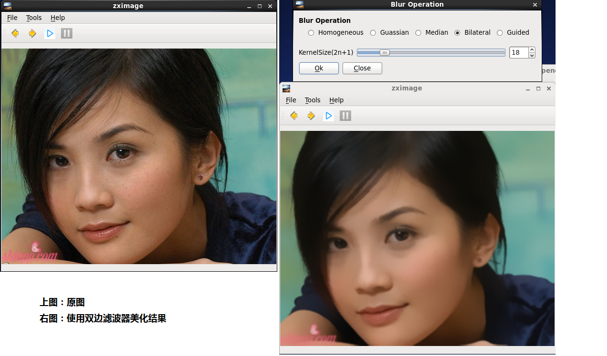
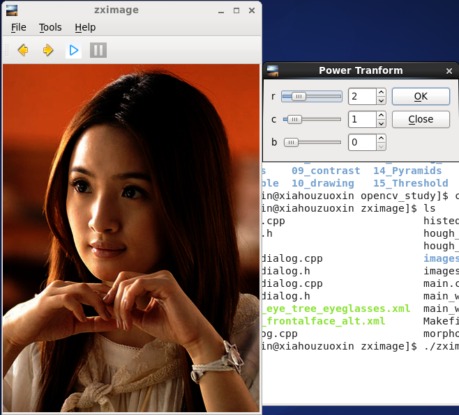
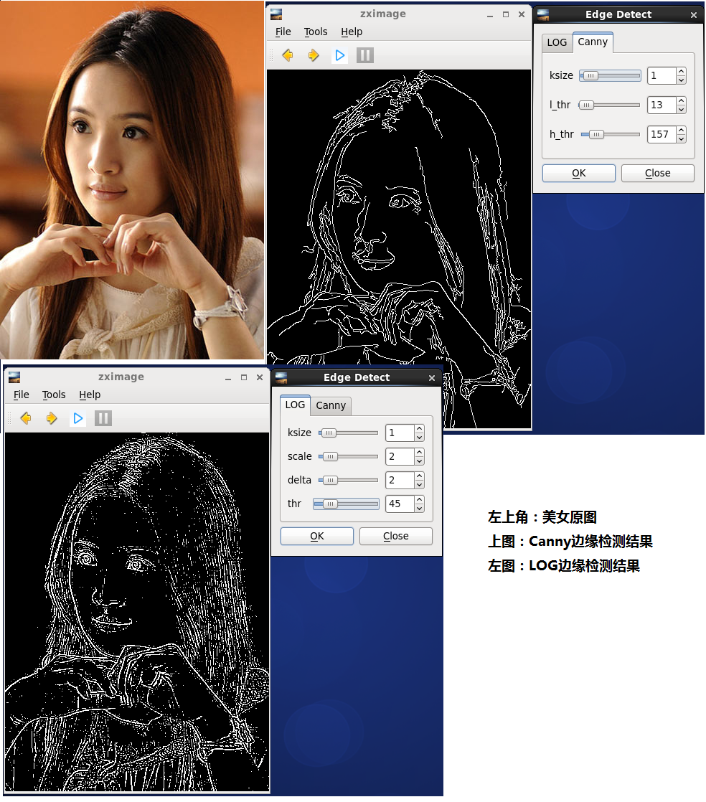
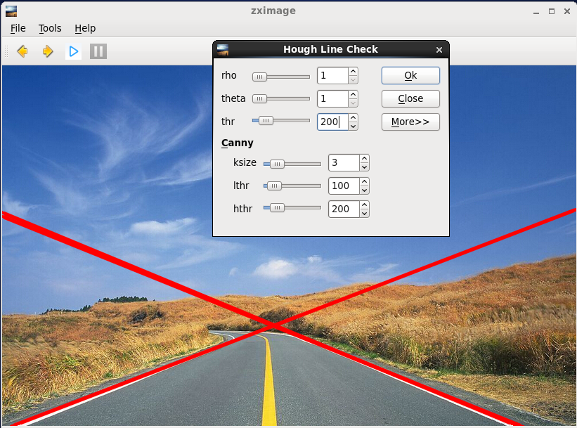
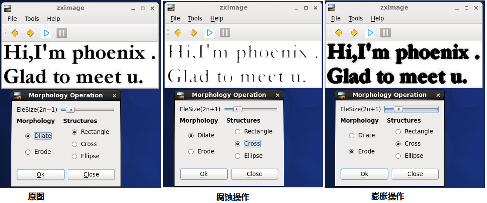
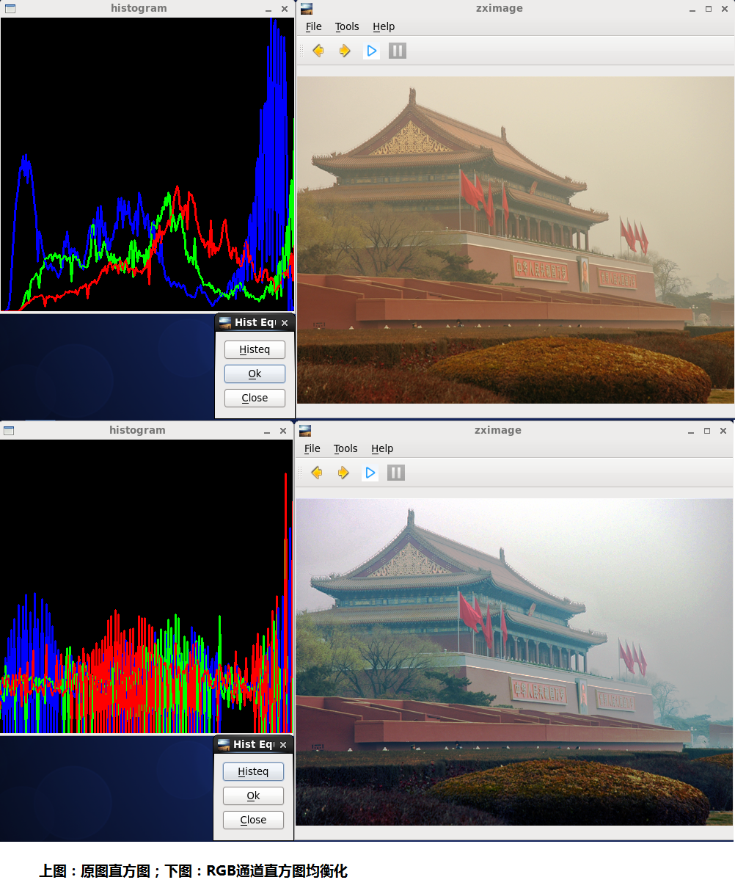
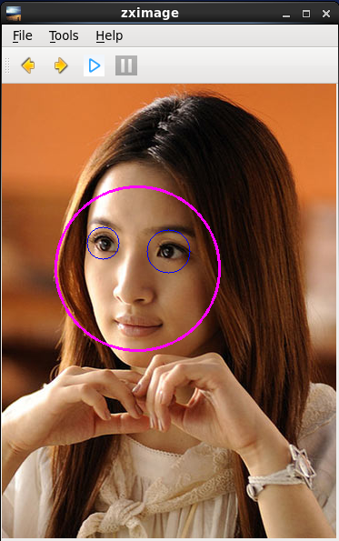
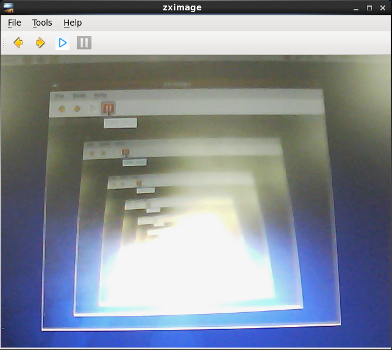
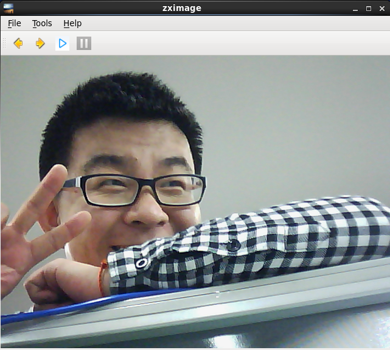
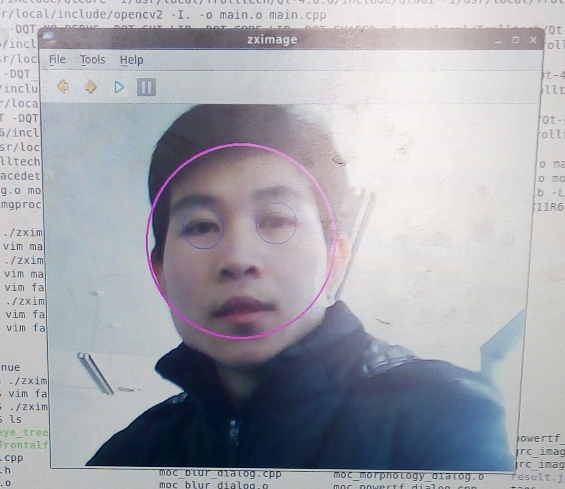

<!---title:OpenCV集成到Qt的尝试-zximage-->
<!---keywords:OpenCV,Qt,zximage-->
<!---date:2015-01-14-->

这一个多月的时间一直忙着写程序，做论文，都没来得及更新博客，当时定下的伟大目标——每周一篇——就这样一溜烟的随着时间的缝隙划过，又留下我低徊忏悔。这是2015年的第一篇博文，希望自己继续坚持下去。回头看看之前写得博文，回忆渐渐涌上心头啊……

回顾了下之前的OpenCV博文，这次用Qt简单做了个界面程序（且给个名字zximage），关于在Qt中集成OpenCV在[搭建Qt界面的OpenCV开发环境](http://xiahouzuoxin.github.io/notes/html/搭建Qt界面的OpenCV开发环境.html)一文中详细的讨论过了。我在做zximage之前C++不熟，Qt基本上0基础，这种滥竽充数的作品按理是拿不上台面的，但虚荣心作怪，在初学者面前显摆显摆还是可以的，这里就展示展示吧，也许将来哪天回过头来看看（明年毕业的时候回来看这些幼稚的东西又会是什么感受呢？）

一开始是主界面，菜单栏做得很简单，就File,Tools,About，图片载入和保存对话框那是必须的，都在File菜单下，

Tools中是一些图像处理的算法（大部分都来自OpenCV），选择算法后都会弹出对话框，用于设置算法相关参数。下面就用Blur滤波器来进行磨皮的美化操作，

图像中边缘检测很常见，zximage当然给加上了，

Hough变换检测道路边界，

形态学操作在OpenCV的图像处理篇中也用过，

直方图均衡化在图像处理中应用还是很普遍的，优点就是能自适应——不用设置参数，

人脸检测简直碉堡了，设计这些算法的人吃的都是啥啊，下面是Haar算子进行的人脸检测结果，

为了证明这个软件的摄像头功能确实是可用的，我拿着摄像头对着屏幕的运行的zximage拍。瞬间大吃一惊，这是什么！！怎么这么多窗口！！！好像发明避孕套的人发现了避孕套一样，很是惊喜，我似乎看到了鸡生蛋蛋生鸡的问题。。。。拍下软件窗口，摄像头界面显示窗口，又将显示额窗口拍下，又显示。。。所以中心出现极亮的光斑。。。

然后我把这个现象给实验室的师兄看，顺带给帅锅师兄来了一张，

最后来一张zximage的自拍人脸检测，这个是手机拍下的屏幕照片，屏幕太亮没办法，

## 源码

源码下载请到我的Github： <https://github.com/xiahouzuoxin/opencv_study> ,那里不仅包括zximage的源码，还包括我的OpenCV系列所有博文的源码，OpenCV系列博文链接可以在 <http://xiahouzuoxin.github.io/notes/README.html> 找到。
