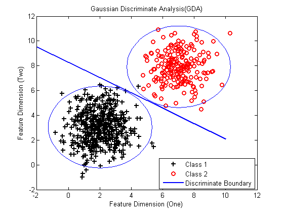

<!---title:Stanford机器学习课程笔记2-高斯判别分析与朴素贝叶斯-->
<!---keywords:Maching Learning-->
<!---date:2015-04-16-->

## 判别学习算法和生成学习算法

- 判别学习算法：直接学习p(y|x)，即直接通过输入特征空间x去确定目标类型{0,1}，比如Logistic Regression和Linear Regression以及感知学习算法都是判别学习算法。

- 生成学习算法：不直接对p(y|x)建模，而是通过对p(x|y)和p(y)建模。比如，y表示目标是dog(0)还是elephant(1)，则p(x|y=1)表示大象的特征分布，p(x|y=0)表示狗的特征分布。下面的高斯判别分析和朴素贝叶斯算法都是生成学习算法。

生成学习算法通过学习p(y|x)和p(y)，一般都要通过贝叶斯公式转化为p(x|y)来进行预测。


最大释然估计也可以转换为联合概率的最值。


## 高斯判别分析（Gaussian Discriminant Analysis）

对于输入特征x是连续值的随机变量，使用高斯判别分析模型非常有效，它对p(x|y)使用高斯分布建模。

，其中p为先验概率


依据前面对生成学习算法的分析，求联合概率的最大似然估计，


求得4个参数值及其直观解释为：


直观含义：类目1的样本数占总样本数的比例，即先验概率，类目0的先验概率刚好是 $1-\phi$ 


直观含义：类目0每个维度特征的均值，结果是nx1的向量，n为特征维度


直观含义：类目1每个维度特征的均值，结果是nx1的向量


下面随机产生2类高斯分布的数据，使用高斯判别分析得到的分界线。分界线的确定：P(y=1|x)=p(y=0|x)=0.5

```matlab
% Gaussian Discriminate Analysis
clc; clf;
clear all

% 随机产生2类高斯分布样本
mu = [2 3];
SIGMA = [1 0; 0 2];
x0 = mvnrnd(mu,SIGMA,500);
y0 = zeros(length(x0),1);
plot(x0(:,1),x0(:,2),'k+', 'LineWidth',1.5, 'MarkerSize', 7);
hold on;
mu = [7 8];
SIGMA = [ 1 0; 0 2];
x1 = mvnrnd(mu,SIGMA,200);
y1 = ones(length(x1),1);
plot(x1(:,1),x1(:,2),'ro', 'LineWidth',1.5, 'MarkerSize', 7)

x = [x0;x1];
y = [y0;y1];
m = length(x);

% 计算参数: \phi,\u0,\u1,\Sigma
phi = (1/m)*sum(y==1);
u0 = mean(x0,1);
u1 = mean(x1,1);
x0_sub_u0 = x0 - u0(ones(length(x0),1), :);
x1_sub_u1 = x1 - u1(ones(length(x1),1), :);
x_sub_u = [x0_sub_u0; x1_sub_u1];
sigma = (1/m)*(x_sub_u'*x_sub_u);

%% Plot Result
% 画分界线,Ax+By=C
u0 = u0';
u1 = u1';
a=sigma'*u1-sigma'*u0;  
b=u1'*sigma'-u0'*sigma';  
c=u1'*sigma'*u1-u0'*sigma'*u0;  
A=a(1)+b(1);
B=a(2)+b(2);  
C=c;  
x=-2:10;  
y=-(A.*x-C)/B;  
hold on;  
plot(x,y,'LineWidth',2);

% 画等高线
alpha = 0:pi/30:2*pi;
R = 3.3;
cx = u0(1)+R*cos(alpha);
cy = u0(2)+R*sin(alpha);
hold on;plot(cx,cy,'b-');
cx = u1(1)+R*cos(alpha);
cy = u1(2)+R*sin(alpha);
plot(cx,cy,'b-');

% 加注释
title('Gaussian Discriminate Analysis(GDA)');
xlabel('Feature Dimension (One)');
ylabel('Feature Dimension (Two)');
legend('Class 1', 'Class 2', 'Discriminate Boundary');
```



## 朴素贝叶斯算法(Naive Bayesian)

相较于高斯判别分析，朴素贝叶斯方法的假设特征之间条件条件，即有：


特别注意：特征之间条件独立是强假设。比如文本上下文的词汇之间必然存在关联（比如出现'qq'和'腾讯'这两个词就存在关联），只是我们的假设不考虑这种关联，即使如此，有时候Bayesian的效果还是非常棒，朴素贝叶斯常用语文本分类（比如最常见的垃圾邮件的检测）。下面是一份非常直观的以实例的方式介绍贝叶斯分类器的文档（如果显示不出来请换用Chrome浏览器，我后面的python代码也将用文档中的数据做example），

<embed width="800" height="600" src="../enclosure/Stanford机器学习课程笔记2-高斯判别分析与朴素贝叶斯/Bayesian Classification withInsect_examples.pdf"> </embed>

看完上面的文稿，我们再来说明理论点的建模。Naive Bayesian对先验概率和似然概率进行建模，不妨设 $\phi_{i|y=1}=p(x_i=1|y=1)$ ， $\phi_{i|y=0}=p(x_i=1|y=0)$ ， $\phi_y=p(y=1)$ , 则又联合概率的似然函数最大，


求解得到先验概率和似然概率：


直观含义：类目1中出现特征xj的频率，实际实现时只要通过频次进行计数即可


直观含义：类目0中出现特征xj的频率，实际实现时只要通过频次进行计数即可


直观含义：类目1的样本数占总样本数的比例，即先验概率，类目0的先验概率刚好是 $1-\phi$ ，这个和GDA的结果是相同的。

这里有个Trick，为什么不要对“证据因子”p(x)建模呢，（1）首先，p(x)可以通过似然概率和先验概率求得；（2）其次，p(x)的作用主要是起到概率归一化的效果，我们可以直接在程序中对最后的p(x,y)进行归一化就得到了p(y|x)。有了上面的结论，即已知先验概率和似然概率，很容易求的p(y=1|x)和p(y=0|x)。比较p(y=1|x)与p(y=0|x)的大小，若p(y=1|x)>p(y=0|x)则分类到类目1，p(y=0|x)>p(y=1|x)则分类为类目0。下面是我用python实现的Naive Bayesian（今后还是少用Matlab，多用python吧，毕竟Matlab只适合研究不能成产品。。。），

```python
#!/usr/bin/env python
# *-* coding=utf-8 *-*

'Bayesian Classification'

__author__='xiahouzuoxin'

import logging
logging.basicConfig(level=logging.INFO)

class NaiveBayesian(object):

    def __init__(self, train_data, train_label, predict_data=None, predict_label=None):
        self.train_data = train_data
        self.train_label = train_label
        self.m = len(self.train_label)  # 样本数目
        self.n = len(train_data[1]);  # 特征数目，假设特征维度一样
        self.cls = list(set(train_label));
        self.predict_data = predict_data
        self.predict_label = predict_label
        self.__prio_p = {}
        self.__likelihood_p = {}
        self.__evidence_p = 1
        self.__predict_p = [];

    def train(self):
        # 统计目标出现概率：先验概率
        p_lb = {}
        for lb in self.train_label:
            if lb in p_lb:  
                p_lb[lb] = p_lb[lb] + 1
            else:
                p_lb[lb] = 1+1  # Laplace smoothing，初始为1，计数+1
        for lb in p_lb.keys():
            p_lb[lb] = float(p_lb[lb]) / (self.m+len(self.cls))
        self.__prio_p = p_lb

        # 统计都有啥特征
        p_v = {}
        feat_key = [];
        for sample in self.train_data:
            #print sample
            for k,v in sample.iteritems():
                feat_key.append((k,v))
                if (k,v) in p_v:
                    p_v[(k,v)] = p_v[(k,v)] + 1
                else:
                    p_v[(k,v)] = 1+1  # Laplace smoothing
        for v in p_v:
            p_v[v] = float(p_v[v]) / (self.m+p_v[v])
            self.__evidence_p *= p_v[v]  # 条件独立假设
        
        # 统计似然概率
        keys = [(x,y) for x in self.cls for y in feat_key]
        keys = set(keys)
        p_likelihood = {};
        for val in keys:
            p_likelihood[val]=1    # Laplace smoothing, 初始计数为1
        for idx in range(self.m):  # 统计频次
            p_likelihood[(self.train_label[idx],feat_key[idx])] = p_likelihood[(self.train_label[idx],feat_key[idx])] + 1
        for k in p_likelihood:  # 求概率
            if self.cls[0] in k:
                p_likelihood[k] = float(p_likelihood[k]) / (self.m*self.__prio_p[self.cls[0]]+2)
            else:
                p_likelihood[k] = float(p_likelihood[k]) / (self.m*self.__prio_p[self.cls[1]]+2)
        self.__likelihood_p = p_likelihood
    
    def predict(self):
        label = [];
        for x_dict in self.predict_data:  # 可以处理多维特征的情况
            likeli_p = [1,1];
            for key,val in x_dict.iteritems():  
                likeli_p[0] = likeli_p[0] * self.__likelihood_p[(self.cls[0], (key,val))]  # 条件独立假设
                likeli_p[1] = likeli_p[1] * self.__likelihood_p[(self.cls[1], (key,val))]

            p_predict_cls0 = likeli_p[0] * self.__prio_p[self.cls[0]] / self.__evidence_p
            p_predict_cls1 = likeli_p[1] * self.__prio_p[self.cls[1]] / self.__evidence_p
            norm = p_predict_cls0 + p_predict_cls1
            p_predict_cls0 = p_predict_cls0/norm
            p_predict_cls1 = p_predict_cls1/norm
            self.__predict_p.append({self.cls[0]:p_predict_cls0})
            self.__predict_p.append({self.cls[1]:p_predict_cls1})
            if p_predict_cls1 > p_predict_cls0:
                label.append(self.cls[1])
            else:
                label.append(self.cls[0])

        return label,self.__predict_p

    def get_prio(self):
        return self.__prio_p

    def get_likelyhood(self):
        return self.__likelihood_p
```

我们将上面的python代码保存为`bayesian.py`文件，下面是python代码的Example测试实例（example.py）：

```
#!/usr/bin/env python
# *-* coding=utf-8 *-*

__author__='xiahouzuoxin'

import bayesian

# 一维特征情况
# train_data = [ {'Name':'Drew'},
#         {'Name':'Claudia'},
#         {'Name':'Drew'},
#         {'Name':'Drew'},
#         {'Name':'Alberto'},
#         {'Name':'Karin'}, 
#         {'Name':'Nina'},
#         {'Name':'Sergio'} ]
# train_label = ['Male','Female','Female','Female','Male','Female','Female','Male']
# predict_data = [{'Name':'Drew'}]
# predict_label = None;

# 多维特征的情况
train_data = [ {'Name':'Drew','Over170':'No','Eye':'Blue','Hair':'Short'},
        {'Name':'Claudia','Over170':'Yes','Eye':'Brown','Hair':'Long'},
        {'Name':'Drew','Over170':'No','Eye':'Blue','Hair':'Long'},
        {'Name':'Drew','Over170':'No','Eye':'Blue','Hair':'Long'},
        {'Name':'Alberto','Over170':'Yes','Eye':'Brown','Hair':'Short'},
        {'Name':'Karin','Over170':'No','Eye':'Blue','Hair':'Long'}, 
        {'Name':'Nina','Over170':'Yes','Eye':'Brown','Hair':'Short'},
        {'Name':'Sergio','Over170':'Yes','Eye':'Blue','Hair':'Long'} ]
train_label = ['Male','Female','Female','Female','Male','Female','Female','Male']
predict_data = [{'Name':'Drew','Over170':'Yes','Eye':'Blue','Hair':'Long'}]
predict_label = None;

model = bayesian.NaiveBayesian(train_data, train_label, predict_data, predict_label)
model.train()
result = model.predict()
print result
```

输出结果：


### 拉普拉斯平滑（Laplace smoothing)

当某个特征未出现时，比如 $p(x_1000|y)=0$ ， 则由于独立条件必然使 $p(x_1,x_2,...,x_{5000})=0$ ， 这样就造成贝叶斯公式中的分子为0。我们不能因为某个特征（词汇）没在训练数据中出现过就认为目标出现这个特征的概率为0（正常情况没出现的概率应该是1/2才合理）。为了应对这种情况，拉普拉斯平滑就能应对这种贝叶斯推断中的0概率情况。


上面的python源代码中就考虑了Laplace smoothing。
