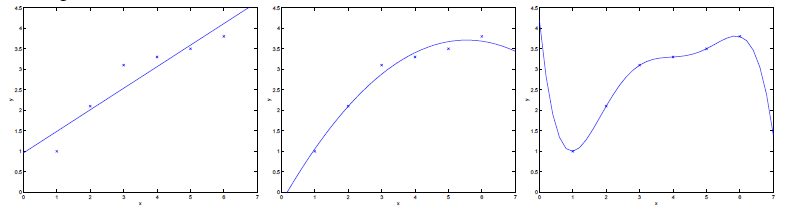
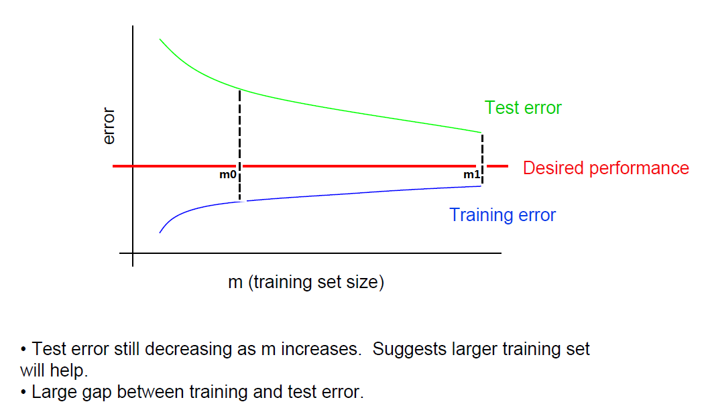
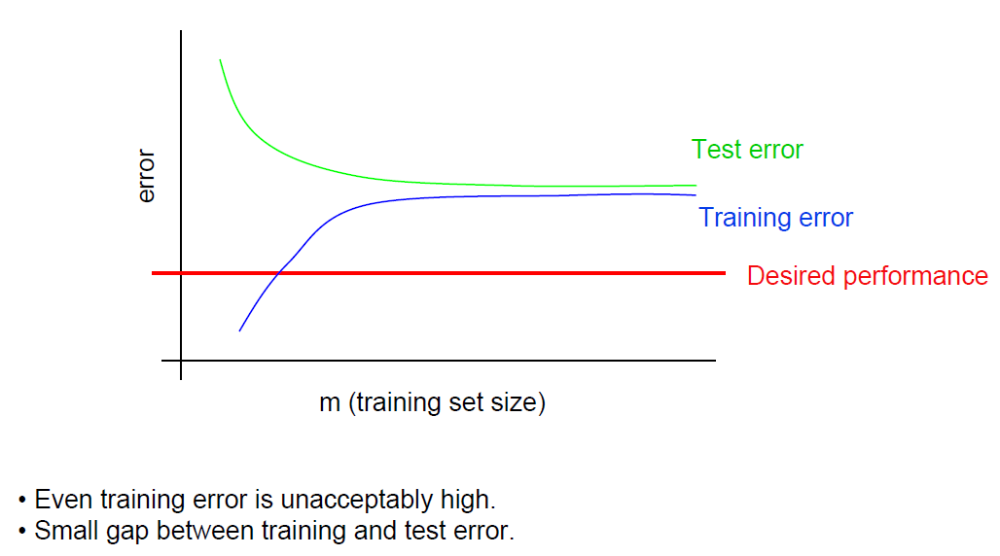
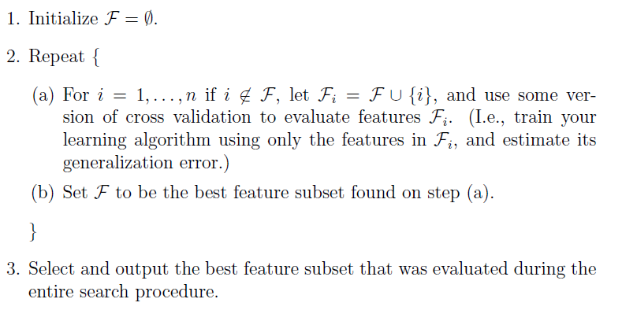
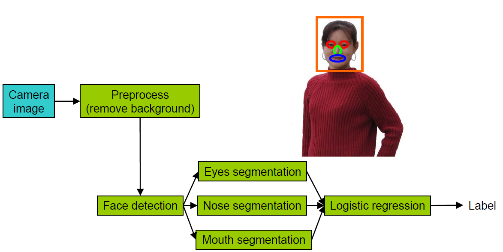
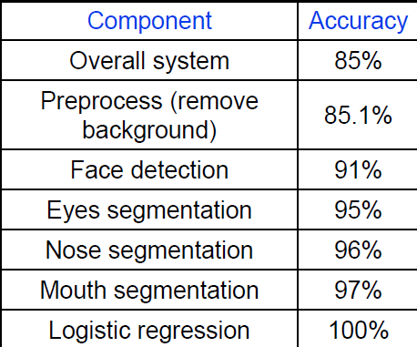

<!---title:Stanford机器学习课程笔记3-学习理论部分-->
<!---keywords:机器学习-->
<!---date:2014-05-04-->

博文都是以Andrew Ng的讲义为基础，但绝不是照搬照抄，完全是自己理解后的总结。

## 简单补充点SVM吧

关于SVM的笔记博客内没有整理，主要是因为

1. 自己对SVM是比较熟悉，大大小小的识别也用过很多SVM了，对SVM的一些理论和使用技巧可看看我之前整理的关于LibSVM使用
    1. [ libsvm笔记系列（1）——编译使用LIBSVM](http://blog.csdn.net/xiahouzuoxin/article/details/9369131)
    2. [LibSVM笔记系列（2）——如何提升LibSVM分类效果](http://blog.csdn.net/xiahouzuoxin/article/details/9372805)
    3. [LibSVM笔记系列（3）——初学移植libsvm的C/C++版本](http://blog.csdn.net/xiahouzuoxin/article/details/9377441)
2. 已经有很多关于SVM的资料和博文

另外，关于LibSVM的理论，除了Andrew Ng给的Handout外，推荐的就是林智仁两份资料：

1. [林智仁SVM讲义(英文)](http://download.csdn.net/detail/xiahouzuoxin/5778927)
2. [林智仁的SVM使用方法讲义](http://download.csdn.net/detail/xiahouzuoxin/5778941)

好了，SVM不多说了，本文主要是要说一些偏机器学习中实践的东西（虽然标题是学习理论，但其实是机器学习实践更恰当些）。

## 偏置(Bias)与方差(variance)

如上图，左边是使用一阶线性模型欠拟合，右边是使用高阶模型而产生了过拟合。因此，有条很重要的结论：

> 模型并不是越复杂越好，复杂模型应对简单问题容易产生过拟合。实践时要预先对问题进行分析和定义，比如：把数据plot出来看一下

偏置(Bias)对应的就是线性最小二乘中损失函数J的大小，因此偏置越小说明对训练数据的拟合程度越好。如上右图偏置最小，尽管如此，我们不能以偏概全（因为偏置是在训练数据上进行的衡量，对于未知数据的预测效果并不一定很好），因此引入了方差(variance)。方差是指拟合模型的波动程度，如上右图拟合模型波动太大，产生了过拟合，因此方差也是越小越好。考虑对偏置和方差进行折中，上中图才是最佳的拟合方案。

对于分类器误差的衡量有两个重要的概念应该理解：

1. 训练误差：也有称经验风险(emprical risk)/经验误差(emprical error)，指的是模型在训练数据集的误差

2. 预测误差：也有称泛化误差(generalization error)，指的是模型在未知样本即预测数据集上的误差

，其中D为预测数据集

如上图是实际训练过程中训练误差和预测误差随训练样本数的变化：

- 在m=m0位置， 很大，即训练误差和预测误差差值很大，主要由于训练样本过少造成了过拟合（对应variance很大），导致训练误差很小而预测误差很大，针对上图的解决方案就是增加m值。应对过拟合问题还有一些其它的方式，当我们的样本数据集缺乏的时候，其它方案也非常有效（下面会讨论）
- 在m=m1位置，  很小了，训练误差接近预测误差说明模型的泛化能力好，当继续增加训练样本数量已经很难再对模型的性能有很大改善了

如上图是实际训练过程中训练误差和预测误差随训练样本数变化的另一种情况：

- 训练误差很大，甚至超过了期望的误差边界，这个时候明显发生了欠拟合，也就是说模型还没有充分的学习训练数据特征。这个时候对应Bias很大，主要可能是两种情况造成的：
	1. 模型国语简单，应该提高模型复杂度（比如：从2阶线性模型提高到4解线性模型，模型的参数也随之增加，或者改用更复杂的模型如SVM、深度学习等）；
	2. 特征简单，区分特性差，应该进行特征选择（下面会讲到怎么做），检验特征是否合适并选择合适的特征进行训练

## 过拟合的解决方案

之前到北京电视台听一个现场节目，有个主持人问：怎么才能做好一个演讲？大家莫衷一是，没想到主持人给的回答却是：“把话筒对着自己的嘴”。想想，很有道理啊。如何应对过拟合问题？回答是：“你得确定确实已经发生了过拟合”。怎么确定？上一节其实已经提到过，“排除不是欠拟合(训练误差很大)的情况，当训练误差和预测误差相距甚远的时候(m=m0)的情况就是发生了过拟合”。应对过拟合一般有以下几种方案：

1. 减小模型复杂度，降低模型阶次。当然，改模型不是最佳的办法，不得已而用之
2. 减小特征维度n，仅保留有利特征，减少无效特征的干扰
3. 增加训练样本数量。当然，数据是如此的珍贵，也不是说有就有的，如果有，这无疑是最简单的办法
4. 规则化（Regularization），这是最常用的方法，尤其Paper中很常见。规则化也有多种办法：
	1. 增加  正则化项
	2. 用MAP替代ML估计，其中的参数先验概率p(\theta)有正则化（避免过拟合）效果。这部分就不做笔记了，详见[Andrew Ng的讲义](http://cs229.stanford.edu/notes/cs229-notes5.pdf)中Bayesian statistics and regularizaiton部分

## 交叉验证(Cross validation)

那既然不能用训练误差衡量分类器的好坏，那如何在训练数据集上衡量一个分类器的好坏呢。或者说，如何选择最佳的分类器参数呢？对了，就是交叉验证(CV)。CV是用来验证分类器的性能一种统计分析方法,基本思想是把在某种意义下将原始数据(dataset)进行分组,一部分做为训练集(train set),另一部分做为验证集(validation set),首先用训练集对分类器进行训练,在利用验证集来测试训练得到的模型(model),以此来做为评价分类器的性能指标。

1. Hold-Out Method

	将原始数据随机分为两组,一组做为训练集,一组做为验证集,利用训练集训练分类器,然后利用验证集验证模型,记录最后的分类准确率为此Hold-OutMethod下分类器的性能指标.此种方法的好处的处理简单,只需随机把原始数据分为两组即可,其实严格意义来说Hold-Out Method并不能算是CV,因为这种方法没有达到交叉的思想,由于是随机的将原始数据分组,所以最后验证集分类准确率的高低与原始数据的分组有很大的关系,所以这种方法得到的结果其实并不具有说服性.

2. K-fold Cross Validation(记为K-CV)

	将原始数据分成K组(一般是均分),将每个子集数据分别做一次验证集,其余的K-1组子集数据作为训练集,这样会得到K个模型,用这K个模型最终的验证集的分类准确率的平均数作为此K-CV下分类器的性能指标.K一般大于等于2,实际操作时一般从3开始取,只有在原始数据集合数据量小的时候才会尝试取2.K-CV可以有效的避免过学习以及欠学习状态的发生,最后得到的结果也比较具有说服性.

3. Leave-One-Out Cross Validation(记为LOO-CV)

	如果设原始数据有N个样本,那么LOO-CV就是N-CV,即每个样本单独作为验证集,其余的N-1个样本作为训练集,所以LOO-CV会得到N个模型,用这N个模型最终的验证集的分类准确率的平均数作为此下LOO-CV分类器的性能指标.相比于前面的K-CV,LOO-CV有两个明显的优点:

	- 每一回合中几乎所有的样本皆用于训练模型,因此最接近原始样本的分布,这样评估所得的结果比较可靠。
	- 实验过程中没有随机因素会影响实验数据,确保实验过程是可以被复制的。

	但LOO-CV的缺点则是计算成本高,因为需要建立的模型数量与原始数据样本数量相同,当原始数据样本数量相当多时,LOO-CV在实作上便有困难几乎就是不显示,除非每次训练分类器得到模型的速度很快,或是可以用并行化计算减少计算所需的时间.

在LibSVM中，可以通过设置svm-train的-v参数设置交叉验证，-v表示交叉验证的分组数。

## 特征选择

现在面临这么一个问题：现在采集了很多特征，有些对分类是有效的，有些是无效的，但不知道哪些有效，哪些无效。如何从这些特征集合F中选择有效的特征子集Fi，这本身是一个NP-Hard问题，如果随机组合特征放进训练机训练，则自少要有2^N种情况，N是特征类别数。有一种启发式的方法可以进行特征选择操作：

然而，上面的方法效果一般来说还是不错，但依然很慢，需要O(N^2)，该方法称为Forward search。当然，上面是一个个地加特征，也先设F为特征全集，然后一个个地减特征，这种方式称为Backward search。Andrew Ng老师还提供了复杂度更低，但相对效果要差一些的算法：Filter feature selection。计算特征xi和label y之间的相关特性，使用互信息(mutual information)来度量，

其中p(xi,y)、p(xi)、p(y)都可以从训练数据中估计出来，上面的MI(x,y)其实就是KL距离，

KL距离表示了两个向量之间的diffrence，MI越接近0，说明特征xi与y之间的独立性越好，特征对label y的贡献越小。最后对MI排个序，选择相关性最大的K个特征就好。不过，实际效果听说要比直接用Forward search差不少，主要优势就是复杂度低O(1)。

## 实际中各组件对分类的贡献（Error Analysis）

Andrew Ng老师下面的Face Recognition任务，任务中提取特征包括很多组件（背景移除、人脸检测、眼睛分割、鼻子分割、嘴分割），怎么衡量各个组件对最终分类效果的影响？

先搭建系统原型(Overall system)，直接输入图像作为特征进行识别，再逐一加入特征，没次加入特征后都与Groudtruth进行对比得到精度：

从表中可以看出，从remove background到Face detection提升效果显著91%-85.1%，而remove background仅提升了1%，所以remove background是无关紧要的特征，而Face detection操作却非常重要。