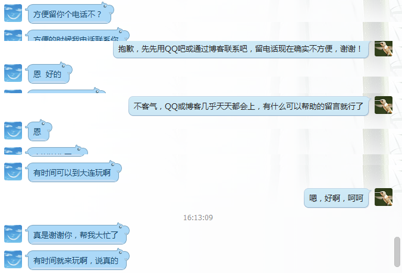
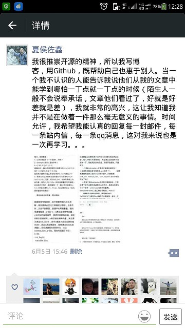
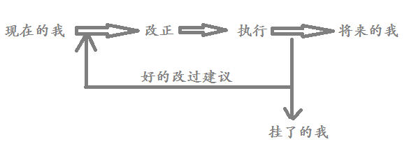

<!---title:拾掇起来的年华3-->
<!---keywords:写作-->
<!---date:2015-06-08, V1版修改稿2015-06-13--->

噢，已经本科毕业2年了，回头看3年前的伤感成长之作，如今又接着往下写，不免有伤时之感。身边的同学朋友已经换了一批，想想人生短短900个月，不免想起老掉牙的：

> 旧时王谢堂前燕，飞入寻常百姓家。

变迁之快，不可预估。想刚入大学（2009年）那会儿，什么物联网、云计算还是在娘胎里的词，深度学习2006年就有了，也没见有这么火热，FPGA在国内强劲的市场劲也鲜有出现（如今却有大势吞噬DSP的趋势）。那时，新浪微博还刚刚起步，压根就没有微信，那时的诺基亚还算是霸王机。没有小米，因为那时的的乔帮主还在——以及它重新发明的手机iPhone……老罗也搞了锤子，之前看完老罗的[一个理想主义者的创业故事](http://v.youku.com/v_show/id_XODQzMDQ0NTQ0.html?firsttime=0&f=23165978)，不得不佩服……

我怕我部分的记忆再也找不回来，每每都是想着毕业的时候再写，却发现为时已晚（本来是2013年毕业的暑假想要完成这篇的），就像再也找不回那时的玩诺基亚贪吃蛇的感觉，再也找不回儿时看的90年代《天龙八部》的感觉。所以我不禁意地触动我的键盘，心里如悬着的明镜，搜索着快乐、翻悔、懵懂的往事。接下来的事情似乎从意外保研那会儿开始……

## 意外保研篇

不像其它的人，努力地考试是为了考研保研，我努力考试是为了证明自己确实学会了，将来随时能用上。学习这方面洁哥是我的榜样，直到现在博士在读还一直复习本科高数、现代、概率论，这是一种在这个利益社会中崇高的非利益的追求。尽管我没有保研的想法，却还是一不小心被保了。我也看得透，同专业的玮哥很想保研却仅当差一点点，我当时就想把名额让出去的冲动，不过周围同学的建议阻止了我这么做。幸好玮哥以其它的方式最后还是成功保上了研，否则我会为没有放弃名额这件事此而非常地内疚。

我本科毕设是和专业的刘老师做的，刘老师很年轻，不是名师，也不出名，不是王志良那种被传扬得老牛逼的老师。但踏实的性子、不深却具有引导性的专业知识可能会（为什么说可能会，后面会知道）改变我的一生。他是我大学里对我方向影响最深的一位老师，还有翔神（我后来研究生同宿舍的同学）对我的帮助非常大，当然，专研的细活还得靠自己了，反正不管你信不信，我本科毕设没有看一篇中文论文，却看了打印纸摞起来15cm厚的英文论文，有些是散落在电脑鼠实验室了。保研面试刚出来就碰到了研究生导师张老师，张老师和刘老师不一样，和蔼的性格、强的管理经验，领导范。他是学院的副院长——要我大四进研究生实验室，我……同意了！我想着我的研究生生活该从大四就这样开始了吧！然而事实却不是这样发展的，估计刘老师找张老师聊了聊，刘老师最后告诉我的时候是这样和我说的，“我跟张老师说过了，借用你半年，跟着我做图像方面的研究”。我自诩自己也是个有主见的人，和张老师那边商洽之后，我开始了我的“图像之旅”。


## 研究生篇

又何曾能想到，这接下来的大四后半年的时间（噢，有些不对，其实在那之前已经跟着刘老师做了大半年了，只不过是保研后接着往下做）改变了快要研究生毕业的我。我的研究生研究生涯就像是在正常的人生道路上原地打转了两年一样，重新又回到起点……

大四毕业后的那个暑假是艰苦的一个暑假。导师张老师要求我假期留学校，进入实验室学习，那个时候学校已经把我们这批老学生驱赶出了宿舍。无家可归的我在电脑鼠的地下室住了快两个月，虽说也还算干净，但里面的潮湿、夏天的蚊子，每天睡不到6小时。白天去研究生实验室，晚上提着个桶跑到6斋去洗澡，6斋的楼管阿姨每次都是惊讶地看着我。我在感情上是个慢调子的人，刚毕业，当身边的朋友都要离别的时候还不是那么的感伤（更多的是期盼，期盼你们过得好），但是在毕业典礼之后的1个月之后，晚上一个人在地下室听陈楚生的《想念》，我竟然哭了……


反正这样，我大四毕业的那年暑假没有回家……就从那个暑假开始，我就开始承担实验室的项目，写技术策划书、准备DSP、FPGA都是我一个人，喔，对了，还有“苦逼屌丝”万老师（（掩面）如果万老师看到不要骂我，这是师兄师弟说的）。万老师是个兢兢业业的老师，我觉得作为一个老师的本职就应该是这样——以教导学生为本职，为何要逼着他们越俎代庖完成发论文这种由研究员该做的工作。然而，现实的中国教育却似乎颠倒黑白一样，好老师得不到翻身，有些（请注意是有些，我并不想一棍子打死）靠着这个论文那个论文却缺乏实践经验能好好教导学生的老师却……（不说了）。像万老师这样，还有我认识的CSDN的[贺利坚老师](http://blog.csdn.net/sxhelijian/)，甘为草根，多么令人敬佩！


就这样我是从大四毕业的暑假就开始进入研究生实验室。我放下了研究了1年多的图像，重操嵌入式的旧业——搞硬件、ARM、DSP、FPGA。从图像的道路上趟了过来，我的本科过去了，我的研究生该怎么过？从那个暑假开始，我就觉得应该做点什么，也许，是缺一些目标吧！也就在2013年7月14日和2013年8月22日，我分别画下了一张“研究生的事”的图谱和一张“专业知识图谱”（幸好都还能找得到），我想把图谱的说明放到文章最后。


项目要用到DSP，只得啃TI的官方英文文档，为DSP和声音信号的问题到中科院电子所和中科院声学所找技术支持。设计原理图，手焊电路板，记得连续焊了几天，被焊锡的烟都熏得感冒流鼻涕了。没有实验环境，寒冬的凌晨2-3点和万老师到京藏高速附近采集大卡车震动信号，N次的冬天晚上硬是等到11点半之后学校五环广场人都回了跑过去做实验，冻得瑟瑟发抖；测试声信号相关算法一个人而在实验室通宵达旦。最后甚至于一听到卡车声音就敏感——啊这声音不是可以用来做实验吗？这其中其它错综复杂的各种挫折也就搁下不提了……好了，我就是这样占用了研究生的前1年半的大部分光阴（到一个月前）。

毕业要发小论文，导师在2014年7、8月那个时间给我们实验室Email了一个投稿通知。我当时想了想，为了毕业写写投吧，但是写什么呢，主题是关于无线传感网定位的——我不会（应该说是一点都不懂）。我找了两篇传感网定位的survey，大概了解了一下。首先想到的就是从图像里面迁移方法，但都没法生搬硬套。也确实记不起来了，是从哪里看到压缩感知的概念，想想：诶，压缩感知做定位，那不正好！（传感网里面的目标是稀疏的）！照着这个思路，居然发现已经有人也做过这个方向了（只不过相对较少），我把方案改了改，做了些实验，论文就投了，中了，算是蒙混过了毕业吧。

在找实习的时候，我退回到两年前的断点处。我不找硬件相关的工作，然后我问我自己会什么，Jave不会、Html不会、网络不会、操作系统也不太会……。除了C/C++外，唯一熟悉的就是图像和Matlab了。我开始重新拾起图像处理。在这种事情上，一旦下定决心，我就不再犹豫雷厉风行（这和我的人生观有关），我把简历改了，关于硬件的全删了，只留下了诸如“Naive Bayesian、SIFT、Logistic Regresssion、SVM”等等一些稍熟悉点的机器学习算法，把几年前看过一部分的Andrew Ng的Stanford课程这次重新看了一遍，并大部分算法自己动手编程实现，开始看PRML，开始学深度学习，开始继续关注前沿论文……只有一个多月的时间，这种方向的重大转变促使我跟着大一的新生一样挤图书馆、上自习……幸好，还是找到了一份实习，我紧紧抓住这微妙而不想错失的机会，尽管一开始还没有签合同入职，但我再也没有参加其它的笔试。在签合同前的那一周多时间里，我把自己当作已经入职的，找公司的人要论文，看论文做PPT。借着CSDN这个平台，开始参加会议，拓宽视野，结交同道朋友……

## 我写博客的那些事

大三开始结识CSDN，大四开始发博文，不过一年下来也没写几篇。研一是CSDN发文的爆发期，写了很多关于dsp实践、算法相关的文章。帮过不少网友的忙，文章也好几次推荐到CSDN主页，我也看着自己的博客排名从万名之后步入现在的1700多名，从普通博友变成博客专家。CSDN还给我寄过几期杂志和一本《剑指offer》。CSDN还打电话邀请我录视频、写专题，但都因为事忙而暂时拒绝了。




我为什么写博客？我和有些朋友讨论过，我一直有种观点：一个人真正了解某个知识或观点，那他必定能把这个观点给别人讲清楚，如果讲不清楚那就说明他自己都是半桶水。鉴于此，我写博客的理由：（1）人是善忘的动物，我要时刻记下我可能会忘记的东西；（2）帮助别人；（3）教会别人，证明自己真正会了，得到认同也是一方面。



## 关于感情

大学读了6年，我从一开始就坚持一个原则——学成南归。在感情问题上，本着对无南下想法的女生青春负责任的态度，我总会为感情犹豫不觉。善良的我（哈哈有点自夸的嫌疑）不是不敢下手而是不忍心下手，耽误女生遇见有缘人，在我看来，那是多么大的罪过！

下面我要进入状态了，以叙述的方式，仅从我的角度，用平凡的语言随意记述几个简单普通的故事。认识“她”的朋友看到，请保持你的美女的低调和帅哥的绅士。“她”看到，如果觉得以下有什么侵犯到你的，请以任何方式联系我，我立刻删除。

我对她，不是一见钟情，应该说是认识很久都没有钟情。那种触动是随着日子随着交往慢慢的爬上我的心头。。。

我记得她几次过来都给我买水果，那时纯粹的友情让我无任何的非分之想。也让我帮了一些小忙，因为太小，什么忙也不记得了。起初我是以一种朋友礼尚往来的心理和她交往的，了解我的人大概知道，我不喜欢欠人情，别人有时欠我倒无所谓。上天作证，我也送过她过水果。


我努力去回想，就像心理学里面的短暂性失忆，实在回忆不起来上面那段时间发生过什么事，而那些细微的事触及到我对她的感觉。这是一段不短的时间，至少是从2015年的年前到年后。这随后的记起来的关于她的事，我的原则没变，但对她的感觉和心境却已经变了！

她说她平常不吃早饭，我第二天早上就买了豆浆和紫薯饼给她送过去。给她打电话，她说还没起，不方便下来拿，不吃了。天啊，那天早上我居然听她的话喝了两大杯豆浆！从尊重她的角度来说，后来就没有不经过她同意就买过了。那天她打电话跟我对早上的事道歉，我又怎么会为这种小事生她的气呢！

我生日那天（愚人节）意外收到一份生日礼物——温暖的大白。。。当天我一拿到包装看到上面的淘宝名就知道是谁送的，可那时的我还是在舍友面前故作惊讶了一番，我怕我经不住他们的轮番轰炸最终会妥协地把她给供出来，我还是害怕这种八字没一撇的事情影响到她的声誉。拿到礼物的我热血沸腾，冷不住想手舞足蹈一番，思绪万千，纠结犹豫了一个下午，晚上才给她回了个简讯(原谅我找不到了)，大致意思是：谢谢你的礼物，非常棒，大白很可爱，我很开心也很喜欢。。。也就这样，我努力克制自己的情绪，依然极不舒服地犹豫着，像耗着血。。。

我决定做一份独一无二的礼物，作为一个惊喜。我不能直接找她要照片，于是偷偷地从她的空间，朋友圈，还有好久没上过的人人找了一些，有一起出去玩过的，也有她毕业的，有她和她朋友的……我没有放我的照片。挑选，裁剪，调色，滤镜，洗印，折腾了一两周，选好了相册，画笔。对于毫无艺术细胞的我这几乎算是第一次绘画，但为了她我还是下定决定尝试一番，笨拙的线条估计会让看到的人嘲笑一番吧。。。不过我还是很开心。。。

本来是她的生日礼物，却比她的生日晚到几天，即使这样她依然很高兴。刚拿到手，“啊”，“太有心了”，每翻一页都很是惊讶，然后说了句“我有立刻嫁给你的冲动”，可能是无意的，但我的心里咯噔了一下。。。幸好微弱的路灯光没照在我兴奋又纠结的面庞上，口拙的我不知道该说什么，一直说“你喜欢就好，你开心就好，你高兴就行。。。”重复了很多遍。我还是没有借机下手。。。

当她告诉我找到有缘人，我心里猛的一沉，像被大石块压着，堵得慌，我深深地呼吸了几口气！但随即她给我介绍他的时候，我告诉自己应该为她高兴。我强作镇定地和他握了手，“祝你幸福”。我再也不敢直视她的脸庞。在之后的某个难入眠的晚上，我照着心境写下了一小首打油诗：

```
我很想，看你吃早饭时微笑的脸庞
可我却，怕亵渎，低着头
我很想，听到你惊喜时的“啊”
可我却，故作地镇定，一脸肃容
我很想，在热天里给你撑上一把遮阳伞
可我却，迟迟的不敢靠近你的娇容

我很想，每早都第一个发去问候的简讯
可我却，被犹豫的思念占据着心胸
我很想，陪你夜晚漫步操场
可我却，笨拙的言语无法聊到你心口
我很想，看着你的眼眸，像着了色的春夏秋冬
可我却，徘徊着，踽踽独行中

啊，祝你一路顺风！

（《放下》夏侯佐鑫于2015.06.10凌晨1:30）
```

有人说，人生有两件大事，“一次说走就走的旅行和一次奋不顾身的爱情”，现在我已经失去了一件，我要在今年端午之后准备一次说走就走的旅行……

## 目标图谱与我的人生观

我先说个很“无聊”的故事（故事也忘记从哪本杂志上看到的，网上也没搜到，就且凭着自己的记忆记下来吧）：

著名的英国戏剧作家萧伯纳被邀请参加一个名人宴会，与他同去的还有一位不知名的作家。参加宴会的要不是上层人士要不是社会名流，萧伯纳这时已经很有名了，宴会很Happy。宴会中途，萧伯纳邀请他这位同道的作家朋友上台演讲几句话。作家很拘谨，战战兢兢，“在场的都是名声在外，我一个无名小卒上去讲话会被人笑死，我还是不去了”，萧伯纳想了想，走了几步又回过头对作家说，“在这里，压根就没人会认真听你的演讲，又怎么会有人笑话你呢！”

就像我今天写下的这篇文章，又有多少人看，我怎么会怕写得不好呢，我尽力的写出我的真实年华！这样的一个小故事却建立了我多年的自信，课程PPT演讲我很积极的充当组长的角色，我在台上讲的时候可以毫不紧张潇洒自如地陈诉自己的观点。每每遇到一些挑战性的事，我就告诉自己，“去做呗，做得不好又有谁怪罪”，于是乎我觉得我就一点点的在这种锻炼中成长。我不会像以前一样我每做一件事之前都顾着别人的眼光，除了感情上的事，我变得越来越雷厉风行。2012年写《拾掇起来的年华1》的时候我就写下了这么一句我至今记忆犹新的话：“一个人的喜欢就是把偶然间闪过的念想坚持，直到它变成一种习惯!”我在慢慢践行着我细致思索后写下的这些话。

专业知识的图谱是2013年7月14日（1年11个月前）绘制的。我看过了各种中国古典哲学，背过孙子兵法，分析过金庸，我有篇博文专门讲我看书的经历的——《[一个程序猿从金庸开始的读书历程](http://blog.csdn.net/xiahouzuoxin/article/details/40680553)》，有篇博文专门写金庸小说的——《[金庸武侠小说之我的见解](http://blog.csdn.net/xiahouzuoxin/article/details/25560453)》。很多书其实并不是一开始就想着要去读，而是为了解身边的生活。比如，我每次坐着公交，看着窗外的井然有序的车水马龙，庞大的一个北京，为何为形成如此稳定的秩序？于是我想到了《国富论》，我觉得为解答我的疑惑我要读一读。比如，我前几天晚上做了几个相同的梦，我就觉得奇怪，我就觉得要读一读佛洛依德的《梦的解析》，所以我现在就在读它。我选择读书，一是为了了解我身边的生活，一是为了形成独属于自己的兴趣爱好和独一无二的价值观念。专业的书所有人都读，自不必说了！

“研究生的事”中我努力做到了一个善良的人，我喜欢无偿的帮助任何人，我学习时间管理，用熟了印象笔记和思维导图，我写博客成了博客专家，我从2公里气喘到现在能匀速跑下7公里。我听别人的意见，正在努力改掉自己的坏毛病。我看书，我找到了苏东坡一样的精神最求，曾国藩一样的为人准则，胡适一样的严谨治学作风，他们共同成为我现在的标杆和榜样。学过理工科的都知道，好的反馈是最稳定的系统，以后的我将这样度过



## 后记

2015年6月8日，请得了半天假，无意间却促成此文的初稿。周末对此文进行增删改查，我现在一向对自己要求严格精细（以前不是），我来来回回把原文读了不下20遍，看了改改了看，当确信文章中的每个细节都不是由于一时的心情变化臆想出来的，那些都是我真真实实的、简单的年华。鉴于东西比较多，什么都写了一点点，记录自己人生行程中的一些观点，我将来肯定（是肯定）会回过头来看10遍、100遍这篇文章，回忆到心头，我还会接着改。
