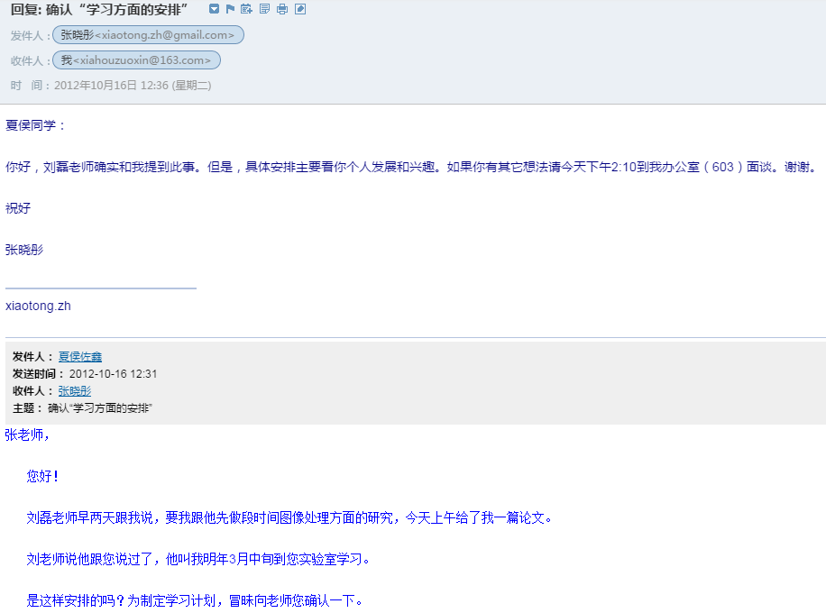
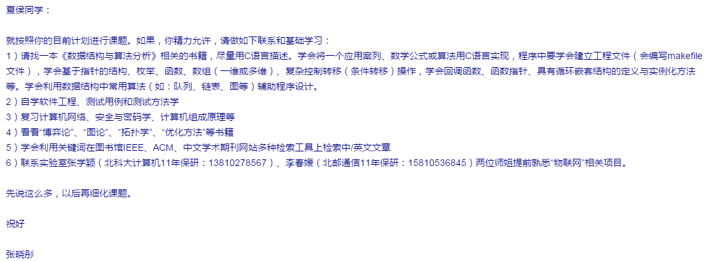
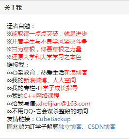
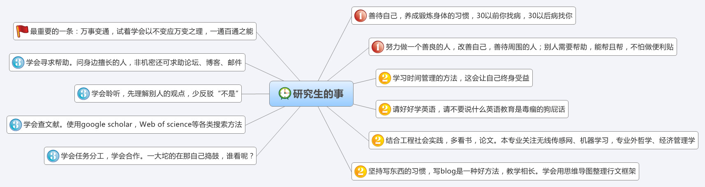

<!---title:拾掇起来的年华3-->
<!---keywords:写作-->
<!---date:2015-06-08--->

噢，已经本科毕业2年了，回头看3年前的伤感成长之作，如今又接着往下写，不免有伤时之感。身边的同学朋友已经换了一批，想想人生短短900个月，不免想起老掉牙的：

> 旧时王谢堂前燕，飞入寻常百姓家。

变迁之快，不可预估。想刚入大学（2009年）那会儿，什么物联网、云计算还是在娘胎里的词，深度学习2006年就有了，也没见有这么火热，FPGA在国内强劲的市场劲也鲜有出现（如今却有大势吞噬DSP的趋势）。那时，新浪微博还刚刚起步，压根就没有微信，那时的诺基亚还算是霸王机。没有小米，因为那时的的乔帮主还在——以及它重新发明的手机iPhone……老罗也搞了锤子，之前看完老罗的[一个理想主义者的创业故事](http://v.youku.com/v_show/id_XODQzMDQ0NTQ0.html?firsttime=0&f=23165978)，不得不佩服……

我怕我部分的记忆再也找不回来，每每都是想着毕业的时候再写，却发现为时已晚（本来是2013年毕业的暑假想要完成这篇的），就像再也找不回那时的玩诺基亚贪吃蛇的感觉，再也找不回儿时看的90年代《天龙八部》的感觉。所以我不禁意地触动我的键盘，心里如悬着的明镜，搜索着快乐、翻悔、懵懂的往事。接下来的事情似乎从意外保研那会儿开始……

## 意外保研篇

不像其它的人，努力地考试是为了考研保研，我努力考试是为了证明自己确实学会了，将来随时能用上。学习这方面洁哥是我的榜样，直到现在博士在读还一直复习本科高数、现代、概率论，这是一种在这个利益社会中崇高的非利益的追求。尽管我没有保研的想法，却还是一不小心被保了。我也看得透，同专业的玮哥很想保研却仅当差一点点，我当时就想把名额让出去的冲动，不过周围同学的建议阻止了我这么做。幸好玮哥以其它的方式最后还是成功保上了研，否则我会为没有放弃名额这件事此而非常地内疚。

我本科毕设是和专业的刘老师做的，刘老师很年轻，不是名师，也不出名，不是王志良那种被传扬得老牛逼的老师。但踏实的性子、不深却具有引导性的专业知识可能会（为什么说可能会，后面会知道）改变我的一生。他是我大学里对我方向影响最深的一位老师，还有翔神（我后来研究生同宿舍的同学）对我的帮助非常大，当然，专研的细活还得靠自己了，反正不管你信不信，我本科毕设没有看一篇中文论文，却看了打印纸摞起来15cm厚的英文论文，有些是散落在电脑鼠实验室了。保研面试刚出来就碰到了研究生导师张老师，张老师和刘老师不一样，和蔼的性格、强的管理经验，领导范。他是学院的副院长——要我大四进研究生实验室，我……同意了！我想着我的研究生生活该从大四就这样开始了吧！然而事实却不是这样发展的，估计刘老师找张老师聊了聊，刘老师最后告诉我的时候是这样和我说的，“我跟张老师说过了，借用你半年，跟着我做图像方面的研究”。我自诩自己也是个有主见的人，和张老师那边商洽之后，我开始了我的“图像之旅”。

## 研究生篇

又何曾能想到，这接下来的大四后半年的时间（噢，有些不对，其实在那之前已经跟着刘老师做了大半年了，只不过是保研后接着往下做）改变了快要研究生毕业的我。我的研究生研究生涯就像是在正常的人生道路上原地打转了两年一样，重新又回到起点……

大四毕业后的那个暑假是艰苦的一个暑假。导师张老师要求我假期留学校，进入实验室学习，那个时候学校已经把我们这批老学生驱赶出了宿舍。无家可归的我在电脑鼠的地下室住了快两个月，虽说也还算干净，但里面的潮湿、夏天的蚊子，每天睡不到6小时。白天去研究生实验室，晚上提着个桶跑到6斋去洗澡，6斋的楼管阿姨每次都是惊讶地看着我。我在感情上是个慢调子的人，刚毕业，当身边的朋友都要离别的时候还不是那么的感伤（更多的是期盼，期盼你们过得好），但是在毕业典礼之后的1个月之后，晚上一个人在地下室听陈楚生的《想念》，我竟然哭了……

反正这样，我大四毕业的那年暑假没有回家……就从那个暑假开始，我就开始承担实验室的项目，写技术策划书、准备DSP、FPGA都是我一个人，喔，对了，还有“苦逼屌丝”万老师（（掩面）如果万老师看到不要骂我，这是师兄师弟说的）。万老师是个兢兢业业的老师，我觉得作为一个老师的本职就应该是这样——以教导学生为本职，为何要逼着他们越俎代庖完成发论文这种由研究员该做的工作。然而，现实的中国教育却似乎颠倒黑白一样，好老师得不到翻身，有些（请注意是有些，我并不想一棍子打死）靠着这个论文那个论文却缺乏实践经验能好好教导学生的老师却……（不说了）。像万老师这样，还有我认识的CSDN的[贺利坚老师](http://blog.csdn.net/sxhelijian/)，甘为草根，多么令人敬佩！

就这样我是从大四毕业的暑假就开始进入研究生实验室。我放下了研究了1年多的图像，重操嵌入式的旧业——搞硬件、ARM、DSP、FPGA。从图像的道路上趟了过来，我的本科过去了，我的研究生该怎么过？从那个暑假开始，我就觉得应该做点什么，也许，是缺一些目标吧！也就在2013年7月14日和2013年8月22日，我分别画下了一张“研究生的事”的图谱和一张“专业知识图谱”（幸好都还能找得到），我想把图谱的说明放到文章最后。

项目要用到DSP，只得啃TI的官方英文文档，为DSP和声音信号的问题到中科院电子所和中科院声学所找技术支持。设计原理图，手焊电路板，记得连续焊了几天，被焊锡的烟都熏得感冒流鼻涕了。没有实验环境，寒冬的凌晨2-3点和万老师到京藏高速附近采集大卡车震动信号，N次的冬天晚上硬是等到11点半之后学校五环广场人都回了跑过去做实验，冻得瑟瑟发抖；测试声信号相关算法一个人而在实验室通宵达旦。最后甚至于一听到卡车声音就敏感——啊这声音不是可以用来做实验吗？这其中其它错综复杂的各种挫折也就搁下不提了……好了，我就是这样占用了研究生的前1年半的大部分光阴（到一个月前）。

毕业要发小论文，导师在2014年7、8月那个时间给我们实验室Email了一个投稿通知。我当时想了想，为了毕业写写投吧，但是写什么呢，主题是关于无线传感网定位的——我不会（应该说是一点都不懂）。我找了两篇传感网定位的survey，大概了解了一下。首先想到的就是从图像里面迁移方法，但都没法生搬硬套。也确实记不起来了，是从哪里看到压缩感知的概念，想想：诶，压缩感知做定位，那不正好！（传感网里面的目标是稀疏的）！照着这个思路，居然发现已经有人也做过这个方向了（只不过相对较少），我把方案改了改，做了些实验，论文就投了，中了，算是蒙混过了毕业吧。

## 退回到两年前的断点处

不想找硬件相关的工作，然后我问我自己会什么，Jave不会、Html不会、网络不会、操作系统也不太会……。除了C/C++外，唯一熟悉的就是图像和Matlab了，因为我的不会又把我逼回到断点。我开始重新拾起图像处理。我把简历改了，关于硬件的全删了，只留下了诸如“Naive Bayesian、SIFT、Logistic Regresssion、SVM”等等一些稍熟悉点的算法，把几年前看过一部分的Andrew Ng这次重新看了一遍，并大部分算法自己动手编程实现，开始看PRML，开始学深度学习，开始继续关注前沿论文……只有一个多月的时间，这种方向的重大转变促使我跟着大一的新生一样挤图书馆、上自习……幸好，还是找到了一份实习，我紧紧抓住这微妙而不想错失的机会，尽管一开始还没有签合同入职，但我再也没有参加其它的笔试。在签合同前的那一周多时间里，我把自己当作已经入职的，找公司的人要论文，看论文做PPT。借着CSDN这个平台，开始参加会议，拓宽视野，结交同道朋友……

## 关于情感

涉及私人问题，还是不说了。不过，洁哥，一定要在电脑鼠队给你门凑成一对。

## 关于目标图谱

专业知识的图谱是2013年7月14日（1年11个月前）绘制的。我看过了各种中国古典哲学，背过孙子兵法，分析过金庸，我有篇博文专门讲我看书的经历的——《[一个程序猿从金庸开始的读书历程](http://blog.csdn.net/xiahouzuoxin/article/details/40680553)》，有篇博文专门写金庸小说的——《[金庸武侠小说之我的见解](http://blog.csdn.net/xiahouzuoxin/article/details/25560453)》。“研究生的事”中我努力做到了一个善良的人，我学习时间管理，我写博客成了博客专家，我从2公里气喘到现在跑到7公里。我听别人的意见，正在努力改掉自己的坏毛病。我看书，我找到了苏东坡一样的精神最求，曾国藩一样的为人准则，胡适一样的严谨治学作风，他们共同成为我现在的标杆和榜样。

## 后记

最近思绪有点乱，又想得有些多了，今天上午请了半天假，无意间却促成此文。且将情怀寄托在这文字上吧……随手暂时结了此文，待后来再修删。前两篇在

1. [拾掇起来的年华](http://blog.csdn.net/xiahouzuoxin/article/details/7853354)
2. [拾掇起来的年化](http://blog.csdn.net/xiahouzuoxin/article/details/7854430)

待后续增改吧。
